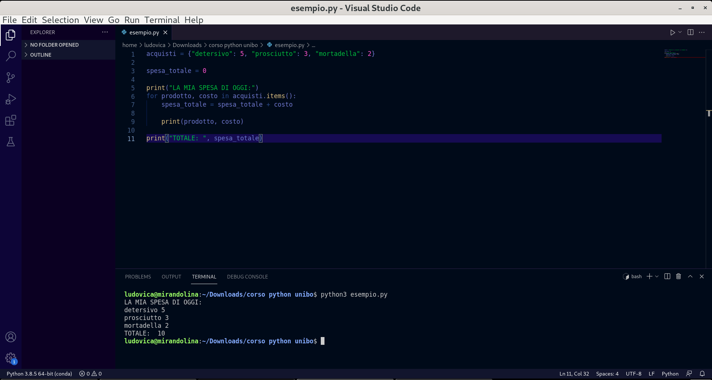
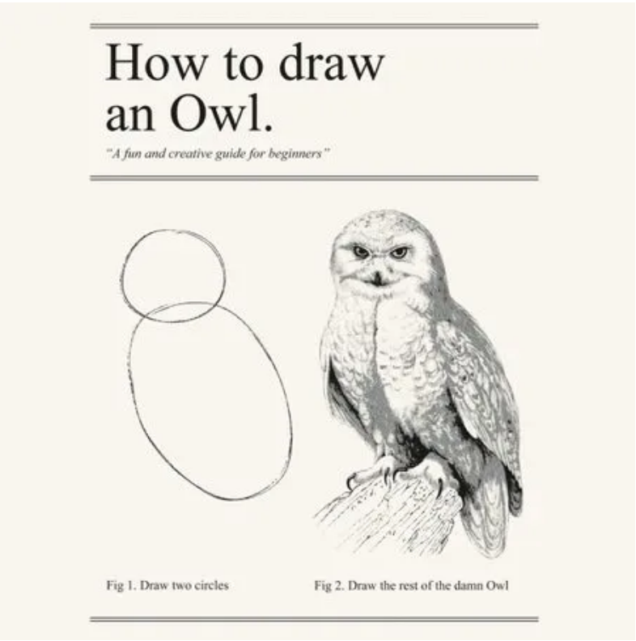
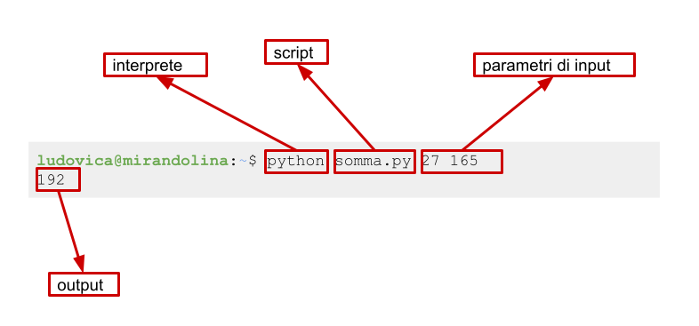

# Modulo 01 · Introduzione alla programmazione e Python

## Chi sono

**Ludovica Pannitto**

NLP Lab Manager · Laboratorio Sperimentale LILEC · Università di Bologna

Ricerca: risorse linguistiche, linguistica cognitiva e Natural Language Processing

- PhD in Cognitive and Brain Sciences — CIMeC, Università di Trento
- Laurea triennale e magistrale in Informatica Umanistica (Language Technologies) — Università di Pisa

GitHub: [ellepannitto](https://github.com/ellepannitto) · Scholar: [profilo](https://scholar.google.it/citations?user=8oLH83IAAAAJ&hl=en)

## Piano del corso

**Informatica di Base · Università degli Studi di Salerno**

Struttura: 30% lezione · 70% esercitazione

| Modulo | Argomento                                                          | Blocco |
| ------ | ------------------------------------------------------------------ | ------ |
| 01     | Introduzione, REPL, tipi fondamentali, Von Neumann, terminale      | 1      |
| 02     | Variabili, assegnamento, `if`/`elif`/`else`, `input()` e `print()` | 1      |
| 03     | Istruzioni condizionali, stato del programma, errori               | 1      |
| **P1** | **Prova intermedia — moduli 1–3**                                  |        |
| 04     | Ciclo `while`, sentinelle, convalida dell'input                    | 2      |
| 05     | Liste: creare, leggere, accumulare, redirezione dell'input         | 2      |
| 06     | Funzioni: parametri, `return`, black box, scope                    | 2      |
| 07     | Memoria, passaggio degli argomenti, side effects                   | 2      |
| **P2** | **Prova intermedia — moduli 4–7**                                  |        |
| 08     | Ciclo `for`, `range()`, cicli annidati, pattern di stampa          | 3      |
| 09     | File di testo, CSV, JSON, terminale avanzato, `sys.argv`           | 3      |
| **P3** | **Prova intermedia — moduli 8–9**                                  |        |
| 10     | Dizionari, set, frequenze, lookup                                  | 4      |
| 11     | Git: repository, commit, GitHub, collaborazione                    | 4      |

I moduli 10 e 11 non sono coperti dalle prove intermedie ma sono inclusi nello scritto finale e nell'orale.

## Modalità d'esame

- **3 prove intermedie facoltative** (durante le ore di corso, già nel monte ore totale)
  - Prova 1: moduli 1–3
  - Prova 2: moduli 4–7
  - Prova 3: moduli 8–9
- **Scritto finale** equivalente alle 3 prove intermedie — almeno un esercizio per blocco
- **Orale** con live coding (principalmente moduli 10 e 11, ma dipende da com'è andato lo scritto!) e domande di teoria

Per ogni blocco viene considerata la valutazione più favorevole tra prova intermedia e scritto finale. Le prove intermedie superare alleggeriscono lo scritto e migliorano il risultato complessivo.

### Bibliografia consigliata

1. Venire a lezione ;)
2. No davvero, venire a lezione
3. **Introduzione a Python** di **Tony Gaddis**

## Cosa facciamo

- partiamo davvero da zero;
- l'obiettivo non è imparare "tutto Python" in poche ore: ci interessa soprattutto capire come codificare un problema in modo chiaro e testabile;
- il focus del corso è sul diventare autonomi nella scrittura di semplici programmi ma soprattutto nell'interpretazione del codice: non siamo informatici!

Per questo il corso insiste su tre livelli diversi:

1. **sintassi** di Python;
2. la **semantica** di base, cioè che cosa significa davvero quello che scriviamo: la vediamo in Python ma è valida per tutti i linguaggi;
3. un **metodo** di lavoro fatto di prove, errori, correzioni e lettura critica dei problemi.

Non ci interessa:

- stile *pythonic* "avanzato" o troppo idiomatico;
- programmazione a oggetti;
- paradigma funzionale;
- ottimizzazione spinta o algoritmi specialistici.

> L'obiettivo del corso è più pragmatico:
> **prima** impariamo a leggere, scrivere e controllare programmi semplici;
> **poi** useremo queste basi per lavorare su dati e problemi reali.

## A fine lezione

- Sai distinguere interprete, editor e terminale?
- Sai lanciare ed utilizzare la REPL di Python?
- Sai riconoscere i tipi fondamentali `int`, `float`, `str` ed eseguire operazioni su di essi?
- Sai descrivere il modello input → elaborazione → output?
- Sai spiegare in modo intuitivo il ruolo di CPU, memoria e file system?
- Sai eseguire comandi base nel terminale? Creare una cartella, cambiare cartella, leggerne il contenuto

## Perché Python

- è un vero linguaggio di programmazione;
- ha una sintassi leggibile, quindi lascia vedere bene i concetti;
- permette di passare rapidamente da un problema a un programma eseguibile.

```python
acquisti = {"detersivo": 5,
            "prosciutto": 3,
            "mortadella": 2}

spesa_totale = 0

print("LA MIA SPESA DI OGGI:")
for prodotto, costo in acquisti.items():
    spesa_totale = spesa_totale + costo

    print(prodotto, costo)

print("TOTALE: ", spesa_totale)
```

<details>
<summary>Output del programma</summary>

```text
LA MIA SPESA DI OGGI:
detersivo 5
prosciutto 3
mortadella 2
TOTALE:  10
```

</details>

- Python è un linguaggio generale;
- ha moltissime librerie e ottima documentazione;
- permette sia scripting rapido sia progetti più strutturati.

## Python in tre aggettivi

Python è un linguaggio **multiparadigma**, **interpretato** e **ad alto livello**.


| Aggettivo                   | Significato                                                                                                      |
| --------------------------- | ---------------------------------------------------------------------------------------------------------------- |
| **ad alto livello**         | il codice è vicino al modo in cui ragioniamo noi, lontano dalle istruzioni della macchina                        |
| **interpretato**            | il programma viene eseguito riga per riga da un interprete, non tradotto tutto in anticipo                       |
| **dinamicamente tipizzato** | i tipi non si dichiarano: vengono determinati a runtime, e operazioni tra tipi incompatibili producono un errore |
| **multiparadigma**          | supporta stili diversi di programmazione (imperativo, funzionale, a oggetti)                                     |

> Per ora basta sapere che esistono. Alla fine della lezione queste parole avranno un significato preciso.

> non vogliamo scrivere codice elegante, ma codice **corretto**, **leggibile** e **controllabile**.

## REPL, tipi e operazioni fondamentali

Iniziamo dalla pratica!
La **REPL** è la modalità interattiva di Python: scrivi un'espressione, premi Invio, Python la valuta e mostra il risultato.

Per esempio:

```python
>>> 3 * (2 + 4)
18
```

Qui Python:

- legge l'espressione `3 * (2 + 4)`;
- calcola prima `(2 + 4)`;
- usa quel risultato nella moltiplicazione;
- mostra `18`.

Per aprirla:

```bash
python3
```

Vedrai qualcosa di simile:

```python
>>>
```

## Tipi fondamentali

Iniziamo a vedere alcuni dei tipi fondamentali di Python:

| Tipo    | Significato           | Esempi                |
| ------- | --------------------- | --------------------- |
| `int`   | numeri interi         | `0`, `7`, `-12`       |
| `float` | numeri con la virgola | `3.14`, `0.5`, `-2.0` |
| `str`   | stringhe di caratteri | `"ciao"`, `'Python'`  |

Il tipo di un valore determina quali operazioni hanno senso su di esso.

### Interi e float

| Operazione       | Sintassi | Esempio   |
| ---------------- | -------- | --------- |
| Somma            | `N + N`  | `3 + 15`  |
| Sottrazione      | `N - N`  | `10 - 4`  |
| Moltiplicazione  | `N * N`  | `3 * 7`   |
| Divisione        | `N / N`  | `7 / 2`   |
| Potenza          | `N ** N` | `3 ** 2`  |
| Divisione intera | `N // N` | `17 // 5` |
| Modulo           | `N % N`  | `17 % 5`  |

<details>
<summary>Esempi</summary>

```python
>>> 3 + 15
18
>>> 3 ** 2
9
>>> 17 // 5
3
>>> 17 % 5
2
>>> 13.8 / 4
3.45
```
</details>

> Occhio a due operazioni con cui potremmo avere meno familiarità:
> - `//` per il **quoziente** della divisione intera;
> - `%` per il **resto** della divisione intera.

<details>
<summary>Divisione in colonna</summary>

- `6 * 7 = 42`
- da `44` avanzano `2`


```python
>>> 44 // 6
7
>>> 44 % 6
2
```
</details>

### Stringhe

Le stringhe sono sequenze di caratteri.

| Operazione     | Sintassi       | Esempio          | Risultato |
| -------------- | -------------- | ---------------- | --------- |
| Concatenazione | `S1 + S2`      | `'ab' + 'cd'`    | `'abcd'`  |
| Selezione      | `S[i]`         | `'ciao'[1]`      | `'i'`     |
| Maiuscolo      | `S.upper()`    | `'ciao'.upper()` | `'CIAO'`  |
| Minuscolo      | `S.lower()`    | `'CIAO'.lower()` | `'ciao'`  |
| Conteggio      | `S1.count(S2)` | `'aaa'.count('a')` | `3`       |
| Lunghezza      | `len(S)`       | `len('ciao')`    | `4`       |

<details>
<summary>Esempi</summary>
```python
>>> 'Hello' + ' ' + 'world'
'Hello world'
>>> 'informatica'[0]
'i'
>>> 'informatica'[3]
'o'
>>> len('Hello world')
11
>>> 'ciao'.upper()
'CIAO'
```
</details>

> L'operatore `+` svolge due operazioni diverse a seconda del tipo di oggetto a cui lo stiamo applicando.
>
> - `+` tra numeri significa somma;
> - `+` tra stringhe significa concatenazione.

Esempio:

```python
>>> "3" + "15"
```

<details>
<summary>Output</summary>
```python
"315"
```

Qui Python non sta facendo un calcolo aritmetico: sta mettendo insieme due sequenze di caratteri.
</details>

#### Selezione di caratteri

In informatica si conta a partire da zero.

```
 l   i   n   g   u   i   s   t   i   c   a
 0   1   2   3   4   5   6   7   8   9  10
-11 -10  -9  -8  -7  -6  -5  -4  -3  -2  -1
```

Si può anche contare dal fondo usando indici negativi: `-1` è l'ultimo carattere, `-2` il penultimo e così via.

```python
>>> "linguistica"[0]
'l'
>>> "linguistica"[-1]
'a'
>>> "linguistica"[-3]
'i'
```

Le sottostringhe si leggono anche per intervalli:

```python
>>> "linguistica"[0:3]
'lin'
>>> "linguistica"[-3:]
'ica'
```

Qui il carattere iniziale è incluso, quello finale no. Omettere il secondo indice significa "fino alla fine".

## Esercizi sulla REPL

Scrivi un'espressione che calcoli:

1. il successore di `15`;
2. la metà del triplo di `12`;
3. il triplo della metà di `12`;
4. il resto della divisione tra `137` e `12`;
5. il doppio della differenza tra `15` e `7`;
6. il doppio della differenza tra `3` e `7`;
7. la somma dei primi tre numeri pari;
8. la media di `2`, `5`, `9`;
9. il resto della divisione tra `44` e `7`;
10. la somma dei quadrati dei primi tre numeri naturali.
11. la lunghezza della stringa `"Happy families are all alike"`;
12. la sua versione tutta maiuscola;
13. la concatenazione di `"Happy families are all alike"` e `"every unhappy family is unhappy in its own way"`;
14. la stessa concatenazione ma con uno spazio in mezzo;
15. il primo carattere di `"informatica"`;
16. il sesto carattere di `"supercalifragilistichespiralidoso"` in maiuscolo;
17. la concatenazione del sesto, nono, decimo, ventiseiesimo e ventisettesimo carattere della stessa stringa;
18. il quintultimo carattere di `"supercalifragilistichespiralidoso"`;
19. il carattere centrale di `"informatica"`.

### Che cosa produce?

1. `5 * (2 + 4)`
2. `152 % 9`
3. `"banana" + "fragola"`
4. `"olio".upper()`
5. `len("carote")`
6. `"cenerentola"[8]`

---

## Espressioni che cambiano tipo

Dalle operazioni viste finora emergono due categorie:

- alcune espressioni **conservano il tipo**: il risultato ha lo stesso tipo degli operandi;
- altre espressioni **cambiano tipo**: il risultato ha un tipo diverso da quello di partenza.

Per esempio:

- la divisione `/` tra interi restituisce **sempre** un `float`, anche quando il risultato è intero (`4 / 2` dà `2.0`);
- `len()` prende una stringa e restituisce un intero;
- l'operatore `*` tra stringa e intero produce una stringa.

| Espressione      | Tipo in ingresso | Tipo in uscita | Cambia tipo? |
| ---------------- | ---------------- | -------------- | ------------ |
| `3 + 5`          | `int` + `int`    | `int`          | no           |
| `"ab" + "cd"`    | `str` + `str`    | `str`          | no           |
| `"ciao".upper()` | `str`            | `str`          | no           |
| `"ciao"[0]`      | `str`            | `str`          | no           |
| `7 / 2`          | `int` / `int`    | `float`        | **sì**       |
| `len("ciao")`    | `str`            | `int`          | **sì**       |
| `"ciao" * 3`     | `str` × `int`    | `str`          | -            |

Nel modulo 2 vedremo anche `int()` e `str()`, funzioni che cambiano tipo in modo esplicito — si chiamano **cast**.

## Torniamo indietro: Python come linguaggio formale

Un linguaggio di programmazione è un linguaggio **formale**: a differenza dell'italiano o dell'inglese,
non ammette ambiguità.
Ogni simbolo ha un significato preciso e le regole di combinazione sono rigide.

Possiamo distinguere tre livelli:

| Componente      | Domanda                              | Esempio in Python                     |
| --------------- | ------------------------------------ | ------------------------------------- |
| **Vocabolario** | Quali simboli sono ammessi?          | `3`, `"ciao"`, `+`, `if`, `def`       |
| **Sintassi**    | Come si combinano correttamente?     | `3 + 2` ✓ — `3 + * 2` ✗             |
| **Semantica**   | Che cosa significa quello che scrivo? | `3 + 2` produce `5`; `"a" + 2` è un errore di tipo |

La distinzione sintassi/semantica è utile già per leggere i messaggi di errore:

- un **errore di sintassi** (`SyntaxError`) significa che hai scritto qualcosa che l'interprete non riesce nemmeno a leggere — come una frase con le parole nell'ordine sbagliato;
- un **errore di tipo** o di **runtime** significa che la sintassi era corretta, ma l'operazione non ha senso per quei valori.

## Che cosa installiamo davvero

Python è il linguaggio: una specifica formale di vocabolario, sintassi e semantica.
In quanto tale non può essere *installato*, è solo un insieme di regole!

Quello che installiamo è l'**interprete**, cioè un programma capace di:

- leggere il codice sorgente;
- verificarne la sintassi;
- eseguire le istruzioni una alla volta.

In questo senso non "installiamo il linguaggio" come idea astratta:
installiamo uno strumento che sa dargli significato.

### Linguaggi ad alto e basso livello

I linguaggi di programmazione non stanno tutti alla stessa distanza dalla macchina.

| Livello           | Idea generale                                        | Esempi            |
| ----------------- | ---------------------------------------------------- | ----------------- |
| **Alto livello**  | più vicino al modo in cui ragioniamo noi             | Python, Java      |
| **Basso livello** | più vicino alle istruzioni effettive della macchina  | C, Assembly       |

In Python, `len("ciao")` è una singola istruzione leggibile.
La CPU, invece, capisce solo operazioni elementari su sequenze di bit:
la distanza tra le due cose è enorme, e l'interprete la colma.

### Interprete e compilatore

Due famiglie importanti di *traduttori*:

| Strumento       | Che cosa fa                                                   | Esempio tipico |
| --------------- | ------------------------------------------------------------- | -------------- |
| **Interprete**  | legge ed esegue il programma riga per riga                    | Python         |
| **Compilatore** | traduce tutto il programma in anticipo, poi produce un eseguibile | C, C++     |

Per capire la differenza tra i due approcci, immaginate un libro scritto in caratteri *thai* che volete leggere.

```
กล้วยไม้เป็นพืชที่มนุษย์รู้จักกันดีมานาน
ในโลกมีกล้วยไม้หลากหลายสกุลและชนิดพันธุ์ในธรรมชาติพบมาแล้วไม่น้อยกว่า ๒๕,๐๐๐ ชนิด
โดยเฉพาะในเขตอบอุ่นและเขตร้อน บริเวณทวีปเอเซีย อเมริกาใต้ และแอฟริกา เป็นแหล่งกล้วยไม้ที่มีความหลากหลายมากที่สุด
กล้วยไม้เป็นต้นไม้ที่มีระบบรากสำหรับหาอาหารเช่นเดียวกับต้นไม้ชนิดอื่น
```

- Con un **compilatore**: qualcuno traduce l'intero libro, ve lo consegna in italiano e voi lo leggete direttamente. Se c'è un errore a pagina 325, il traduttore se ne accorge durante la traduzione, prima che voi apriate il libro.
- Con un **interprete**: avete accanto una persona che vi traduce riga per riga mentre leggete insieme. Se c'è un errore a pagina 325, non ve ne accorgete finché non ci arrivate.

|                                   | Interprete                                | Compilatore                                  |
| --------------------------------- | ----------------------------------------- | -------------------------------------------- |
| **Quando si scoprono gli errori** | durante l'esecuzione, alla riga sbagliata | prima dell'esecuzione, in fase di traduzione |
| **Modalità di lavoro**            | interattiva (REPL)                        | compile → esegui                             |
| **Eseguibile prodotto**           | no — il codice viene riletto ogni volta   | sì — gira senza rifare la traduzione         |

## Architettura di Von Neumann

Tutti i computer moderni seguono un'architettura descritta da Von Neumann negli anni '40, che rimane valida ancora oggi.

L'idea centrale è questa: **un programma è una sequenza di istruzioni memorizzate insieme ai dati**.
La CPU le legge una alla volta, le esegue, e produce un risultato.

### I componenti

```text
                 ┌──────────────────────────┐
                 │           CPU            │
                 │  ┌────────┐  ┌────────┐  │
 Input device ──►│  │  ALU   │  │  Reg.  │  │──► Output device
                 │  └────────┘  └────────┘  │
                 │      ┌──────────────┐    │
                 │      │ Control Unit │    │
                 │      └──────────────┘    │
                 └────────────┬─────────────┘
                              │ ▲
                              ▼ │
                 ┌──────────────────────────┐
                 │       Memory Unit        │
                 └──────────────────────────┘
```

La **CPU** è il motore del computer. Al suo interno troviamo:

| Componente       | Ruolo                                                          | Esempio concreto                                 |
| ---------------- | -------------------------------------------------------------- | ------------------------------------------------ |
| **ALU**          | esegue operazioni aritmetiche e logiche                        | calcola `3 + 2`, confronta `x > 0`               |
| **Registri**     | memoria interna alla CPU, piccolissima e velocissima           | tiene il valore corrente mentre la CPU ci lavora |
| **Control Unit** | coordina il flusso: legge l'istruzione, decodifica, attiva ALU | decide quale passo eseguire dopo                 |

La **memoria (RAM)** e il **disco** non sono la stessa cosa:

| Componente       | Velocità | Persistenza                          | Cosa ci vive                         |
| ---------------- | -------- | ------------------------------------ | ------------------------------------ |
| **RAM**          | veloce   | volatile (si svuota a spegnimento)   | variabili, istruzioni del programma in esecuzione |
| **Disco**        | lento    | persistente (resta senza corrente)   | file `.py`, documenti, immagini      |

I **dispositivi di input/output** collegano il computer al mondo esterno:
tastiera, schermo, mouse, ma anche i file che leggiamo e scriviamo.

### Cosa succede quando un programma viene eseguito

Tra poco lanceremo i nostri primi script dal terminale.
Ogni volta che lo facciamo, sotto il cofano succede questo:

1. il sistema operativo legge il codice python dal **disco** e lo carica in **RAM**;
2. la **Control Unit** legge la prima istruzione dalla RAM;
3. l'**ALU** esegue il calcolo richiesto, usando i **registri** come appoggio temporaneo;
4. il risultato torna in RAM (per esempio, viene assegnato a una variabile);
5. i passi 2–4 si ripetono per ogni istruzione;
6. l'output finale va verso un dispositivo di output: lo schermo, o un file su disco.

> I dati che il programma sta usando "spariscono" quando il programma finisce perché vivono in RAM, non su disco.
> Per conservare un risultato bisogna **scriverlo** esplicitamente su file (i.e., **in output**).

### Attività: simulare Von Neumann

**Setup.** Ci servono 3 volontari! Ciascuno riceve un foglio e interpreta un componente:

| Ruolo       | Componente Von Neumann | Cosa fa durante la simulazione                                                                                                        |
| ----------- | ---------------------- | ------------------------------------------------------------------------------------------------------------------------------------- |
| **CPU**     | Control Unit           | legge le istruzioni una alla volta e le distribuisce agli altri due                                                                   |
| **Memoria** | RAM + ALU              | tiene traccia dei valori `x` e `y`; esegue le operazioni aritmetiche che la CPU le chiede                                             |
| **Schermo** | Dispositivo di output  | riceve dalla CPU le coordinate `(x, y)` e colora la casella corrispondente su una griglia — **tenendo il foglio nascosto agli altri** |

<details>

**Il programma.** La CPU riceve queste istruzioni e le esegue in ordine:

```
Aggiungi 3 a x
Aggiungi 2 a y
Disegna (x, y)
Aggiungi 2 a x
Aggiungi 1 a y
Disegna (x, y)
Sottrai 4 da x
Aggiungi 2 a y
Disegna (x, y)
Aggiungi 2 a x
Disegna (x, y)
FINE
```

**Come funziona.**
- Quando la CPU incontra `Aggiungi N a x`, lo dice ad alta voce alla Memoria. La Memoria aggiorna `x` sul suo foglio.
- Quando la CPU incontra `Disegna (x, y)`, chiede alla Memoria i valori correnti di `x` e `y`, poi li passa allo Schermo. Lo Schermo colora quella casella.
- Alla fine la CPU dice `FINE`. Lo Schermo mostra il risultato agli altri.

**Griglia per lo Schermo** (origine in alto a sinistra, come i display reali):

```
     0   1   2   3   4   5   6   7
   +---+---+---+---+---+---+---+---+
0  |   |   |   |   |   |   |   |   |
   +---+---+---+---+---+---+---+---+
1  |   |   |   |   |   |   |   |   |
   +---+---+---+---+---+---+---+---+
2  |   |   |   |   |   |   |   |   |
   +---+---+---+---+---+---+---+---+
3  |   |   |   |   |   |   |   |   |
   +---+---+---+---+---+---+---+---+
4  |   |   |   |   |   |   |   |   |
   +---+---+---+---+---+---+---+---+
5  |   |   |   |   |   |   |   |   |
   +---+---+---+---+---+---+---+---+
6  |   |   |   |   |   |   |   |   |
   +---+---+---+---+---+---+---+---+
```

</details>

**Domande di discussione.**

- La CPU sapeva cosa stava disegnando? Perché no?
- Cosa avrebbe prodotto un errore di un'istruzione (es. `Aggiungi 4 a x` invece di `Aggiungi 3 a x`)?
- Dove "viveva" il programma? Dove vivevano `x` e `y`?
- Se la Memoria dimenticasse il valore di `x` a metà esecuzione, cosa succederebbe?
- Quali componenti di Von Neumann abbiamo simulato? Quale mancava?

> Il punto più importante: **la CPU non capisce cosa sta disegnando**.
> Esegue le istruzioni una alla volta, meccanicamente.
> Il significato è nel programma, non nella macchina.

## Cos'è un programma

Quando diciamo "apro il programma Word" o "uso Excel", usiamo la parola *programma* nel senso di *applicazione*:
un software completo con interfaccia grafica, menu, impostazioni, cronologia.
Word ed Excel contengono al loro interno migliaia di procedure distinte.

In questo corso useremo *programma* in un senso più specifico:
**una sequenza di azioni che prende dati in ingresso, li elabora e produce un risultato**.

| Fase         | Domanda tipica             |
| ------------ | -------------------------- |
| Input        | quali dati ricevo?         |
| Elaborazione | quali regole applico?      |
| Output       | che risultato restituisco? |

I programmi che scriveremo fanno una cosa sola, in modo chiaro e verificabile. Esempi:

| Programma              | Input           | Output               |
| ---------------------- | --------------- | -------------------- |
| somma di due numeri    | `a`, `b`        | `a + b`              |
| conteggio caratteri    | una stringa     | un numero            |
| scelta del file giusto | nome e percorso | file aperto o errore |

### Esercizio

Scrivi su un foglio le istruzioni per disegnare questa figura alla lavagna:

```
         ) (
         | |
        /|_|\
       /     \
      /       \
     /         \
    /___________\
    |  []   []  |
    |           |
    |   _____   |
    |  |     |  |
    |__|_____|__|
```

<details>
- Dove bisognava iniziare a disegnare? Era specificato nelle istruzioni?
- Quanto doveva essere grande la figura?
- Hai disegnato prima il tetto o le pareti? Importa?
- Cosa succede se due studenti scrivono istruzioni diverse con le stesse intenzioni?
</details>

> Un programma è esattamente questo: una sequenza di istruzioni che una macchina segue alla lettera.
> La macchina non interpreta, non suppone, non corregge.
> Se le istruzioni sono ambigue o incomplete, il risultato è imprevedibile — o sbagliato.

## Ambiente di lavoro

Per iniziare a programmare servono tre strumenti distinti:

| Strumento  | A cosa serve                 | Esempi                  |
| ---------- | ---------------------------- | ----------------------- |
| Interprete | esegue codice Python         | `python3`, REPL         |
| Editor     | scrive e salva file di testo | VSCodium, VS Code       |
| Terminale  | lancia comandi e programmi   | `zsh`, PowerShell, bash |

è importante non confonderli:

- l'editor serve a scrivere il codice;
- il terminale serve a lanciare comandi, tra cui chiamare l'interprete di python;
- l'interprete legge il codice e lo esegue, interfacciandosi con la CPU.

```python
>>> 3 * (2 + 4)
18
```

Questo è diverso da quello che succede in uno script:

- nella REPL il valore di un'espressione viene mostrato automaticamente;
- in un file `.py` il valore viene mostrato solo se usiamo esplicitamente `print(...)`.

La REPL è quindi utile per:

- fare prove rapide;
- controllare il significato di un'operazione;
- osservare subito il risultato;
- leggere i messaggi di errore senza dover creare ogni volta un file.

Normalmente però noi vogliamo scrivere un programma che possiamo salvare e eseguire nuovamente.
Un programma Python di questo genere va scritto in un **text editor** che lavora su testo semplice.

> Word non è un text editor! Aggiunge formattazione e metadati che non fanno parte del testo.

Una sessione di lavoro tipica è questa:

1. scrivi un file `.py` nell'editor;
2. apri il terminale nella cartella giusta;
3. esegui `python3 nome_file.py`;
4. osserva l'output e correggi se necessario.



### Perché conviene usare anche il terminale

È utile imparare fin da subito a non dipendere solo da interfacce grafiche:

- spesso vi troverete a lavorare su un server, dove tipicamente non c'è un'interfaccia grafica completa;
- saper lanciare uno script da riga di comando rende il lavoro più trasferibile.

## Come lavorare

Alcune abitudini utili fin dall'inizio:

- carta e penna prima del codice: la parte difficile spesso viene prima della sintassi;
- fare esercizi piccoli ma frequenti, come quando si impara una lingua;
- non aspettarsi fluidità immediata: all'inizio la programmazione sembra spesso un salto misterioso, poi le cose iniziano a incastrarsi;
- trascrivere il codice invece di copiarlo e incollarlo, sia per evitare errori nascosti sia per fare pratica vera;
- se possibile lavorare in coppia, perché spiegare un problema ad alta voce spesso lo rende più chiaro;
- lettura attenta dei messaggi di errore.

Se qualcosa non funziona:

1. leggi il messaggio;
2. isola un esempio più piccolo;
3. controlla tipi, parentesi, apici, indentazione (vedremo tra poco);
4. confronta quello che volevi fare con quello che il programma fa davvero.



> Programmare include sempre una quota di `trial and error`. Non è un'anomalia: è il lavoro.

> In ogni caso: **"Don't Panic!"**

## Shell e sistemi operativi

Quando un programma lavora con file, cartelle e dati presenti sul computer,
non accede da solo all'hardware: passa attraverso il sistema operativo.

Il sistema operativo:

- mantiene l'organizzazione di file e cartelle nel file system;
- permette ai programmi di aprire, leggere, scrivere e chiudere file;
- tiene traccia di dove si trovano i dati sul disco;
- gestisce la memoria e il tempo di esecuzione dei processi;
- coordina anche l'accesso a periferiche come tastiera, schermo e disco.

Il **terminale** è l'interfaccia a testo del sistema operativo.
Il programma che interpreta i comandi che scriviamo si chiama **shell**.

I sistemi operativi usano shell diverse:

| Sistema operativo | Shell predefinita | Prompt tipico |
| ----------------- | ----------------- | ------------- |
| **macOS**         | `zsh`             | `%`           |
| **Linux**         | `bash`            | `$`           |
| **Windows**       | PowerShell        | `>`           |

**bash** (Bourne Again SHell) è la shell più diffusa nei sistemi Unix.
**zsh** è compatibile con bash e aggiunge funzionalità extra.
I comandi che usiamo a lezione funzionano allo stesso modo in entrambe.

### Windows: due opzioni

Su Windows il terminale nativo è **PowerShell**, che ha una sintassi parzialmente diversa.
I comandi di base (`pwd`, `ls`, `cd`) funzionano anche lì, ma le differenze emergono non appena si va oltre le operazioni elementari.

Per seguire il corso con gli stessi comandi bash:

- usate **Git Bash**, installato insieme a Git: emula bash su Windows
- oppure usate PowerShell sapendo che qualche adattamento sarà necessario

> A lezione useremo sintassi bash. Se siete su Windows con PowerShell, segnalate le differenze quando le incontrate.

### Differenze pratiche tra bash e PowerShell

I comandi visti a lezione funzionano in entrambi i terminali:

| Operazione           | bash / Git Bash   | PowerShell       |
| -------------------- | ----------------- | ---------------- |
| cartella corrente    | `pwd`             | `pwd`            |
| contenuto cartella   | `ls`              | `ls`             |
| entra in cartella    | `cd nome`         | `cd nome`        |
| torna su             | `cd ..`           | `cd ..`          |
| esegui script Python | `python3 file.py` | `python file.py` |

La differenza più comune: il separatore nei percorsi è `\` anziché `/` (anche se PowerShell accetta entrambi).

## Terminale: comandi di base

Il terminale serve a spostarsi nelle cartelle e lanciare programmi.



Comandi essenziali:

| Comando            | Significato                 |
| ------------------ | --------------------------- |
| `pwd`              | mostra la cartella corrente |
| `ls`               | elenca file e cartelle      |
| `cd nome-cartella` | entra in una cartella       |
| `cd ..`            | torna alla cartella padre   |
| `mkdir nome`       | crea una nuova cartella     |
| `python3 file.py`  | esegue uno script Python    |

### Percorsi assoluti e relativi

- un **percorso assoluto** parte dalla radice del sistema (`/` su Unix, `C:\` su Windows);
- un **percorso relativo** parte dalla cartella in cui ti trovi adesso.

Immagina questa struttura di cartelle:

```text
/
└── home/
    └── studente/
        ├── corso/
        │   ├── script.py
        │   └── dati/
        │       └── input.txt
        └── documenti/
            └── appunti.txt
```

Se sei dentro `corso/`, questi percorsi sono equivalenti:

| Percorso                               | Tipo                      | Raggiunge     |
| -------------------------------------- | ------------------------- | ------------- |
| `/home/studente/corso/script.py`       | assoluto                  | `script.py`   |
| `script.py` oppure `./script.py`       | relativo                  | `script.py`   |
| `dati/input.txt`                       | relativo                  | `input.txt`   |
| `../documenti/appunti.txt`             | relativo (salendo di uno) | `appunti.txt` |
| `/home/studente/documenti/appunti.txt` | assoluto                  | `appunti.txt` |

Le scorciatoie fondamentali:

- `.` — la cartella corrente
- `..` — la cartella superiore
- `../../` — due livelli su

L'importante non è usare sempre la forma più lunga, ma capire che il percorso deve descrivere correttamente come arrivare al file partendo dalla posizione attuale.

Esempio:

```bash
pwd
ls
cd esercizi
ls
cd ..
python3 esercizi/esercizio_1.py
```

> Se un comando "non trova il file", il primo controllo da fare è quasi sempre la cartella corrente.

## Esercizio: prepara la tua cartella di lavoro

Creiamo insieme la struttura di cartelle che useremo per tutto il corso.

**Passo 1** — parti dalla tua cartella home e crea una cartella per il corso:

```bash
cd ~
mkdir informatica-di-base
ls
```

Il simbolo `~` (tilde) è una scorciatoia per la tua cartella home — quella che il terminale apre per default all'avvio.
Su macOS corrisponde a `/Users/tuonome`, su Linux a `/home/tuonome`, su Windows (Git Bash) a `C:\Users\tuonome`.

Per digitare `~`:

| Sistema                     | Combinazione                                              |
| --------------------------- | --------------------------------------------------------- |
| macOS                       | `Alt + 5`                                                 |
| Windows (tastiera italiana) | `Alt Gr + ì`                                              |
| Linux                       | `Alt Gr + ì` oppure `Alt Gr + ~` a seconda della tastiera |

Verifica che `informatica-di-base` compaia nell'elenco.

**Passo 2** — entra nella cartella e crea una sottocartella per questa lezione:

```bash
cd informatica-di-base
mkdir modulo-01
ls
```

**Passo 3** — entra nella sottocartella e controlla dove sei:

```bash
cd modulo-01
pwd
```

Dovresti vedere qualcosa come `/home/studente/informatica-di-base/modulo-01`.

**Passo 4** — torna su di un livello e poi ancora su, verificando ogni volta:

```bash
cd ..
pwd
cd ..
pwd
```

**Passo 5** — apri la cartella `informatica-di-base` nell'editor:

```bash
cd informatica-di-base
code .
```

Oppure `File > apri cartella` dall'interfaccia di VSCode

> Questa cartella può diventare il vostro spazio di lavoro per tutto il corso.

## Dal REPL a uno script

Nella REPL ogni espressione produce subito un risultato visibile. In un file le cose funzionano diversamente.

Crea un file `prova.py` nella cartella `modulo-01` e scrivici dentro:

```python
3 + 5
```

Poi eseguilo dal terminale:

```bash
python3 prova.py
```

Non succede niente. Il calcolo viene eseguito, ma il risultato non viene mostrato da nessuna parte.
Per produrre output bisogna usare esplicitamente `print()`:

```python
print(3 + 5)
```

Ora eseguilo di nuovo: vedrai `8`.

### `print()` è esplicita, la REPL no

**REPL** sta per **Read–Eval–Print Loop**: legge l'espressione, la valuta, stampa il risultato, e ricomincia.

|                | REPL                       | Script        |
| -------------- | -------------------------- | ------------- |
| `3 + 5`        | mostra `8` automaticamente | nessun output |
| `print(3 + 5)` | mostra `8`                 | mostra `8`    |

Nella REPL il valore dell'espressione viene mostrato per comodità interattiva.
In uno script il programma non sa dove vuoi mandare l'output — sullo schermo, su un file, da qualche altra parte — a meno che tu non glielo dica.

### L'estensione non è obbligatoria

Prova a rinominare il file togliendo l'estensione:

```bash
python3 prova
```

Funziona ugualmente. Prova anche con `.txt`:

```bash
python3 prova.txt
```

Anche questo funziona. L'interprete Python non guarda l'estensione: legge il contenuto e lo esegue.
L'estensione `.py` è una convenzione per gli esseri umani — aiuta l'editor a colorare il codice e te a capire cosa c'è dentro — ma non cambia nulla per l'interprete.

### Esercizio

Riprendi gli esercizi della REPL e salvali in un file `esercizi-repl.py`, uno per riga, ciascuno dentro una `print()`. Per esempio:

```python
print(3 + 5)
print(len("Happy families are all alike"))
print("informatica"[0])
```

Esegui il file e verifica che l'output corrisponda a quello che avevi ottenuto nella REPL.

## Cosa fa questo programma?

Nella cartella `esercizi/modulo-1/` ci sono i file `es1.py` … `es7.py`. **Non aprirli.**

Per ciascuno:

1. entra nella cartella dal terminale: `cd guida-lezioni/esercizi/modulo-1`;
2. eseguilo più volte con argomenti diversi e osserva l'output;
3. scrivi su carta la tua ipotesi su cosa calcola;
4. confronta con chi è vicino a te;
5. solo alla fine, apri il file e verifica.

### Esercizio 1

```bash
python3 es1.py basilico
python3 es1.py ciao
python3 es1.py informatica
```

<details>
<summary>Cosa fa</summary>

Stampa il numero di caratteri della parola passata come argomento (`len`).

```text
8
4
11
```
</details>

### Esercizio 2

```bash
python3 es2.py basilico
python3 es2.py informatica
python3 es2.py uva
```

<details>
<summary>Cosa fa</summary>

Stampa il primo e l'ultimo carattere della parola (`s[0]` e `s[-1]`).

```text
b  o
i  a
u  a
```

</details>

### Esercizio 3

```bash
python3 es3.py basilico 0
python3 es3.py basilico 3
python3 es3.py informatica 5
python3 es3.py ciao 5
```

<details>
<summary>Cosa fa</summary>

Stampa il carattere in posizione `n` (il secondo argomento) della parola. Ricorda che si conta da zero.

```text
b
i
r
```
</details>

### Esercizio 4

```bash
python3 es4.py ciao
python3 es4.py uva
python3 es4.py mela
python3 es4.py limone
```

<details>
<summary>Cosa fa</summary>

Stampa `0` se la lunghezza della parola è pari, `1` se è dispari (`len(s) % 2`).

```text
0
1
0
0
```

</details>

### Esercizio 5

```bash
python3 es5.py basilico
python3 es5.py ciao
python3 es5.py python
```

<details>
<summary>Cosa fa</summary>

Stampa la parola senza il primo e l'ultimo carattere (`s[1:-1]`).

```text
asilic
ia
ytho
```
</details>

### Esercizio 6

```bash
python3 es6.py 3
python3 es6.py 5
python3 es6.py 10
```

<details>
<summary>Cosa fa</summary>

Stampa il quadrato e il cubo del numero passato come argomento (`n * n` e `n ** 3`).

```text
9   27
25  125
100 1000
```

</details>

### Esercizio 7

```bash
python3 es7.py ciao 2
python3 es7.py ciao 0
python3 es7.py ciao 3
python3 es7.py ciao 10
python3 es7.py x 1
python3 es7.py informatica 4
```

<details>
<summary>Cosa fa</summary>

Il programma prende una stringa `s` e un numero `n` e fa tre cose:

1. stampa `s * n` — l'operatore `*` tra stringa e intero ripete la stringa `n` volte;
2. stampa `s[n]` — il carattere in posizione `n`;
3. stampa `s[:n].upper() + s[n:]` — i primi `n` caratteri in maiuscolo concatenati al resto.
</details>
