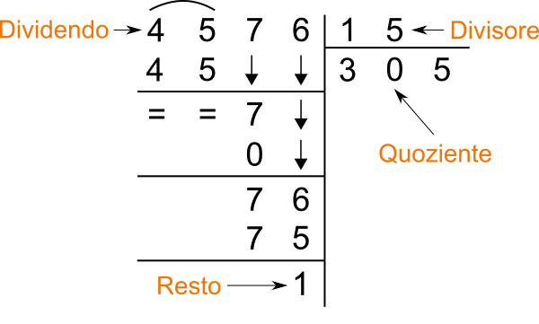

# Modulo 01 · Introduzione alla programmazione e Python

## Obiettivi del modulo

Al termine di questo modulo saprai:

- orientarti tra interprete, editor e terminale;
- usare la REPL di Python per fare prove rapide;
- riconoscere i tipi fondamentali `int`, `float`, `str` ed eseguire operazioni;
- descrivere il modello input -> elaborazione -> output;
- spiegare in modo intuitivo il ruolo di CPU, memoria e file system;
- eseguire comandi base nel terminale.

---

## Cornice del corso

- partiamo davvero da zero;
- l'obiettivo non è imparare "tutto Python" in poche ore: ci interessa soprattutto capire come codificare un problema in modo chiaro e testabile;
- il focus del corso è sul diventare autonomi nella scrittura di semplici programmi ma soprattutto nell'interpretazione del codice: non siamo informatici!

Per questo il corso insiste su tre livelli diversi:

1. **sintassi** di Python;
2. la **semantica** di base, cioè che cosa significa davvero quello che scriviamo: la vediamo in Python ma è valida per tutti i linguaggi;
3. un **metodo** di lavoro fatto di prove, errori, correzioni e lettura critica dei problemi.


Non ci interessa:

- stile *pythonic* "avanzato" o troppo idiomatico;
- programmazione a oggetti;
- paradigma funzionale;
- ottimizzazione spinta o algoritmi specialistici.

> L'obiettivo del corso è più pragmatico: prima impariamo a leggere, scrivere e controllare programmi semplici; poi useremo queste basi per lavorare su dati e problemi reali.

---

## Perché Python

- è un vero linguaggio di programmazione;
- ha una sintassi leggibile, quindi lascia vedere bene i concetti;
- permette di passare rapidamente da un problema a un programma eseguibile.

```python
acquisti = {"detersivo": 5, "prosciutto": 3, "mortadella": 2}

spesa_totale = 0

print("LA MIA SPESA DI OGGI:")
for prodotto, costo in acquisti.items():
    spesa_totale = spesa_totale + costo

    print(prodotto, costo)

print("TOTALE: ", spesa_totale)
```

<details>
<summary>Output del programma</summary>

```text
LA MIA SPESA DI OGGI:
detersivo 5
prosciutto 3
mortadella 2
TOTALE:  10
```

</details>

- Python è un linguaggio generale;
- ha moltissime librerie e ottima documentazione;
- permette sia scripting rapido sia programmi più strutturati.

> Ricordiamo i nostri obiettivi principali:
>
> - codificare un problema
> - imparare sintassi e semantica di base
> - usare strumenti reali: interprete, editor, terminale
>
> non vogliamo scrivere codice elegante, ma codice **corretto**, **leggibile** e **controllabile**.

---

## Come lavorare

Alcune abitudini utili fin dall'inizio:

- carta e penna prima del codice: la parte difficile spesso viene prima della sintassi;
- fare esercizi piccoli ma frequenti, come quando si impara una lingua;
- non aspettarsi fluidità immediata: all'inizio la programmazione sembra spesso un salto misterioso, poi le cose iniziano a incastrarsi.
- trascrivere il codice invece di copiarlo e incollarlo, sia per evitare errori nascosti sia per fare pratica vera;
- se possibile lavorare in coppia, perché spiegare un problema ad alta voce spesso lo rende più chiaro;
- lettura attenta dei messaggi di errore.

Se qualcosa non funziona:

1. leggi il messaggio;
2. isola un esempio più piccolo;
3. controlla tipi, parentesi, apici, indentazione (vedremo tra poco);
4. confronta quello che volevi fare con quello che il programma fa davvero.


> Programmare include sempre una quota di `trial and error`. Non è un'anomalia: è il lavoro.

> "Don't panic" è un buon principio didattico: le prime lezioni servono proprio a costruire familiarità con un linguaggio che all'inizio sembra più difficile di quanto sia davvero.

---

<a id="mod1-repl"></a>
## Iniziamo dalla pratica: REPL, tipi e operazioni fondamentali

La **REPL** è la modalità interattiva di Python: scrivi un'espressione, premi Invio, Python la valuta e mostra il risultato.

Per esempio:

```python
>>> 3 * (2 + 4)
18
```

Qui Python:

- legge l'espressione `3 * (2 + 4)`;
- calcola prima `(2 + 4)`;
- usa quel risultato nella moltiplicazione;
- mostra `18`.

Per aprirla:

```bash
python3
```

Vedrai qualcosa di simile:

```python
>>>
```

### Tipi fondamentali

Iniziamo a vedere alcuni dei tipi fondamentali di Python:

| Tipo    | Significato           | Esempi                |
| ------- | --------------------- | --------------------- |
| `int`   | numeri interi         | `0`, `7`, `-12`       |
| `float` | numeri con la virgola | `3.14`, `0.5`, `-2.0` |
| `str`   | stringhe di caratteri | `"ciao"`, `'Python'`  |

Il tipo di un valore determina quali operazioni hanno senso su di esso.

### Interi e float

| Operazione       | Sintassi | Esempio   |
| ---------------- | -------- | --------- |
| Somma            | `N + N`  | `3 + 15`  |
| Sottrazione      | `N - N`  | `10 - 4`  |
| Moltiplicazione  | `N * N`  | `3 * 7`   |
| Divisione        | `N / N`  | `7 / 2`   |
| Potenza          | `N ** N` | `3 ** 2`  |
| Divisione intera | `N // N` | `17 // 5` |
| Modulo           | `N % N`  | `17 % 5`  |

<details>
<summary>Esempi</summary>

```python
>>> 3 + 15
18
>>> 3 ** 2
9
>>> 17 // 5
3
>>> 17 % 5
2
>>> 13.8 / 4
3.45
```
</details>


> Occhio a due operazioni con cui potremmo avere meno familiarità:
> - `//` per il **quoziente** della divisione intera;
> - `%` per il **resto** della divisione intera.

<details>
<summary>Esempi</summary>

```python
>>> 44 // 6
7
>>> 44 % 6
2
```
</details>

L'idea è la stessa della divisione in colonna:

- `6 * 7 = 42`
- da `44` avanzano `2`



### Stringhe

Le stringhe sono sequenze di caratteri.

| Operazione     | Sintassi       | Esempio          | Risultato |
| -------------- | -------------- | ---------------- | --------- |
| Concatenazione | `S1 + S2`      | `'ab' + 'cd'`    | `'abcd'`  |
| Selezione      | `S[i]`         | `'ciao'[1]`      | `'i'`     |
| Maiuscolo      | `S.upper()`    | `'ciao'.upper()` | `'CIAO'`  |
| Minuscolo      | `S.lower()`    | `'CIAO'.lower()` | `'ciao'`  |
| Conteggio      | `S1.count(S2)` | `'aaa'.count('a')` | `3`       |
| Lunghezza      | `len(S)`       | `len('ciao')`    | `4`       |

<details>
<summary>Esempi</summary>
```python
>>> 'Hello' + ' ' + 'world'
'Hello world'
>>> 'informatica'[0]
'i'
>>> 'informatica'[3]
'o'
>>> len('Hello world')
11
>>> 'ciao'.upper()
'CIAO'
```
</details>

> NOTA:
> l'operatore `+` svolge due operazioni diverse a seconda del tipo di oggetto a cui lo stiamo applicando.
>
> - `+` tra numeri significa somma;
> - `+` tra stringhe significa concatenazione.

Esempio:

```python
>>> "3" + "15"
```

<details>
<summary>Output</summary>
```python
"315"
```

Qui Python non sta facendo un calcolo aritmetico: sta mettendo insieme due sequenze di caratteri.
</details>

#### Selezione di caratteri

In informatica si conta a partire da zero.

```
 l   i   n   g   u   i   s   t   i   c   a
 0   1   2   3   4   5   6   7   8   9  10
-11 -10  -9  -8  -7  -6  -5  -4  -3  -2  -1
```

Si può anche contare dal fondo usando indici negativi: `-1` è l'ultimo carattere, `-2` il penultimo e così via.

```python
>>> "linguistica"[0]
'l'
>>> "linguistica"[-1]
'a'
>>> "linguistica"[-3]
'i'
```

Le sottostringhe si leggono anche per intervalli:

```python
>>> "linguistica"[0:3]
'lin'
>>> "linguistica"[-3:]
'ica'
```

Qui il carattere iniziale è incluso, quello finale no. Omettere il secondo indice significa "fino alla fine".

---

## Esercizi sulla REPL

Scrivi un'espressione che calcoli:

1. il successore di `15`;
2. la metà del triplo di `12`;
3. il triplo della metà di `12`;
4. il resto della divisione tra `137` e `12`;
5. il doppio della differenza tra `15` e `7`;
6. il doppio della differenza tra `3` e `7`;
7. la somma dei primi tre numeri pari;
8. la media di `2`, `5`, `9`;
9. il resto della divisione tra `44` e `7`;
10. la somma dei quadrati dei primi tre numeri naturali.
11. la lunghezza della stringa `"Happy families are all alike"`;
12. la sua versione tutta maiuscola;
13. la concatenazione di `"Happy families are all alike"` e `"every unhappy family is unhappy in its own way"`;
14. la stessa concatenazione ma con uno spazio in mezzo;
15. il primo carattere di `"informatica"`;
16. il sesto carattere di `"supercalifragilistichespiralidoso"` in maiuscolo;
17. la concatenazione del sesto, nono, decimo, ventiseiesimo e ventisettesimo carattere della stessa stringa.

### Che cosa produce?

1. `5 * (2 + 4)`
2. `152 % 9`
3. `"banana" + "fragola"`
4. `"olio".upper()`
5. `len("carote")`
6. `"cenerentola"[8]`

---

## Torniamo indietro: Python come linguaggio formale

Un linguaggio di programmazione è un linguaggio **formale**: a differenza dell'italiano o dell'inglese, non ammette ambiguità. Ogni simbolo ha un significato preciso e le regole di combinazione sono rigide.

Possiamo distinguere tre livelli:

| Componente      | Domanda                              | Esempio in Python                     |
| --------------- | ------------------------------------ | ------------------------------------- |
| **Vocabolario** | Quali simboli sono ammessi?          | `3`, `"ciao"`, `+`, `if`, `def`       |
| **Sintassi**    | Come si combinano correttamente?     | `3 + 2` ✓ — `3 + * 2` ✗             |
| **Semantica**   | Che cosa significa quello che scrivo? | `3 + 2` produce `5`; `"a" + 2` è un errore di tipo |

La distinzione sintassi/semantica è utile già per leggere i messaggi di errore:

- un **errore di sintassi** (`SyntaxError`) significa che hai scritto qualcosa che l'interprete non riesce nemmeno a leggere — come una frase con le parole nell'ordine sbagliato;
- un **errore di tipo** o di **runtime** significa che la sintassi era corretta, ma l'operazione non ha senso per quei valori.

### Che cosa installiamo davvero

Python è il linguaggio: una specifica formale di vocabolario, sintassi e semantica.

Quello che installiamo è l'**interprete**, cioè un programma capace di:

- leggere il codice sorgente;
- verificarne la sintassi;
- eseguire le istruzioni una alla volta.

In questo senso non "installiamo il linguaggio" come idea astratta: installiamo uno strumento che sa dargli significato.

### Linguaggi ad alto e basso livello

I linguaggi di programmazione non stanno tutti alla stessa distanza dalla macchina.

| Livello           | Idea generale                                        | Esempi            |
| ----------------- | ---------------------------------------------------- | ----------------- |
| **Alto livello**  | più vicino al modo in cui ragioniamo noi             | Python, Java      |
| **Basso livello** | più vicino alle istruzioni effettive della macchina  | C, Assembly       |

In Python, `len("ciao")` è una singola istruzione leggibile. La CPU, invece, capisce solo operazioni elementari su sequenze di bit: la distanza tra le due cose è enorme, e l'interprete la colma.

### Interprete e compilatore

Due famiglie importanti di traduttori:

| Strumento       | Che cosa fa                                                   | Esempio tipico |
| --------------- | ------------------------------------------------------------- | -------------- |
| **Interprete**  | legge ed esegue il programma riga per riga                    | Python         |
| **Compilatore** | traduce tutto il programma in anticipo, poi produce un eseguibile | C, C++     |

Un'analogia: il compilatore è come tradurre un libro prima di pubblicarlo — una volta pronto, chiunque lo legge direttamente. L'interprete è come un traduttore simultaneo: traduce mentre parla, riga per riga.

Con un interprete:
- gli errori emergono nel punto esatto in cui il codice viene raggiunto;
- è naturale lavorare in modo interattivo, come nella REPL.

Con un compilatore:
- il programma viene controllato tutto prima dell'esecuzione;
- l'eseguibile prodotto gira senza dover rifare la traduzione ogni volta.

---

<a id="mod1-von-neumann"></a>
## Architettura di Von Neumann

Tutti i computer moderni seguono un'architettura descritta da Von Neumann negli anni '40, che rimane valida ancora oggi.

L'idea centrale è questa: **un programma è una sequenza di istruzioni memorizzate insieme ai dati**. La CPU le legge una alla volta, le esegue, e produce un risultato.

### I componenti

```text
                 ┌──────────────────────────┐
                 │           CPU            │
                 │  ┌────────┐  ┌────────┐  │
 Input device ──►│  │  ALU   │  │  Reg.  │  │──► Output device
                 │  └────────┘  └────────┘  │
                 │      ┌──────────────┐    │
                 │      │ Control Unit │    │
                 │      └──────────────┘    │
                 └────────────┬─────────────┘
                              │ ▲
                              ▼ │
                 ┌──────────────────────────┐
                 │       Memory Unit        │
                 └──────────────────────────┘
```

La **CPU** è il motore del computer. Al suo interno troviamo:

| Componente        | Ruolo                                                          | Esempio concreto                        |
| ----------------- | -------------------------------------------------------------- | --------------------------------------- |
| **ALU**           | esegue operazioni aritmetiche e logiche                        | calcola `3 + 2`, confronta `x > 0`      |
| **Registri**      | memoria interna alla CPU, piccolissima e velocissima           | tiene il valore corrente mentre la CPU ci lavora |
| **Control Unit**  | coordina il flusso: legge l'istruzione, decodifica, attiva ALU | decide quale passo eseguire dopo        |

La **memoria (RAM)** e il **disco** non sono la stessa cosa:

| Componente       | Velocità | Persistenza                          | Cosa ci vive                         |
| ---------------- | -------- | ------------------------------------ | ------------------------------------ |
| **RAM**          | veloce   | volatile (si svuota a spegnimento)   | variabili, istruzioni del programma in esecuzione |
| **Disco**        | lento    | persistente (resta senza corrente)   | file `.py`, documenti, immagini      |

I **dispositivi di input/output** collegano il computer al mondo esterno: tastiera, schermo, mouse, ma anche i file che leggiamo e scriviamo.

### Cosa succede quando esegui `python3 script.py`

1. il sistema operativo legge il file `.py` dal **disco** e lo carica in **RAM**;
2. la **Control Unit** legge la prima istruzione dalla RAM;
3. l'**ALU** esegue il calcolo richiesto, usando i **registri** come appoggio temporaneo;
4. il risultato torna in RAM (per esempio, viene assegnato a una variabile);
5. i passi 2–4 si ripetono per ogni istruzione;
6. l'output finale va verso un dispositivo di output: lo schermo, o un file su disco.

> Le variabili "spariscono" quando il programma finisce perché vivono in RAM, non su disco. Per conservare un risultato bisogna scriverlo esplicitamente su file.

---

<a id="mod1-input-output"></a>
## Cos'è un programma

Un programma è una procedura che prende dati in ingresso, li elabora e produce un risultato.

| Fase         | Domanda tipica             |
| ------------ | -------------------------- |
| Input        | quali dati ricevo?         |
| Elaborazione | quali regole applico?      |
| Output       | che risultato restituisco? |

Esempi:

| Programma              | Input           | Output               |
| ---------------------- | --------------- | -------------------- |
| somma di due numeri    | `a`, `b`        | `a + b`              |
| conteggio caratteri    | una stringa     | un numero            |
| scelta del file giusto | nome e percorso | file aperto o errore |

Qui entra in gioco il **sistema operativo**.

Quando un programma lavora con file, cartelle e dati presenti sul computer, non accede da solo all'hardware: passa attraverso il sistema operativo.

In pratica, il sistema operativo:

- mantiene l'organizzazione di file e cartelle nel file system;
- permette ai programmi di aprire, leggere, scrivere e chiudere file;
- tiene traccia di dove si trovano i dati sul disco;
- gestisce la memoria e il tempo di esecuzione dei processi;
- coordina anche l'accesso a periferiche come tastiera, schermo e disco.

---


<a id="mod1-ambiente"></a>
## Ambiente di lavoro

Per iniziare a programmare servono tre strumenti distinti:

| Strumento  | A cosa serve                 | Esempi                  |
| ---------- | ---------------------------- | ----------------------- |
| Interprete | esegue codice Python         | `python3`, REPL         |
| Editor     | scrive e salva file di testo | VS Code                 |
| Terminale  | lancia comandi e programmi   | `zsh`, PowerShell, bash |

è importante non confonderli:

- l'editor serve a scrivere il codice;
- il terminale serve a lanciare comandi;
- l'interprete Python legge il codice e lo esegue.

```python
>>> 3 * (2 + 4)
18
```

Questo è diverso da quello che succede in uno script:

- nella REPL il valore di un'espressione viene mostrato automaticamente;
- in un file `.py` il valore viene mostrato solo se usiamo esplicitamente `print(...)`.

La REPL è quindi utile per:

- fare prove rapide;
- controllare il significato di un'operazione;
- osservare subito il risultato;
- leggere i messaggi di errore senza dover creare ogni volta un file.


Normalmente però noi vogliamo scrivere un programma che possiamo salvare e eseguire nuovamente.
Un programma Python di questo genere va scritto in un **text editor** che lavora su testo semplice.

> strumenti come Word non vanno bene, perché aggiungono formattazione e metadati che non fanno parte del codice.

Una sessione di lavoro tipica è questa:

1. scrivi un file `.py` nell'editor;
2. apri il terminale nella cartella giusta;
3. esegui `python3 nome_file.py`;
4. osserva l'output e correggi se necessario.


### Perché conviene usare anche il terminale

È utile imparare fin da subito a non dipendere solo da interfacce grafiche:

- spesso vi troverete a lavorare su un server, dove tipicamente non c'è un'interfaccia grafica completa;
- saper lanciare uno script da riga di comando rende il lavoro più trasferibile.


<a id="mod1-terminale"></a>
## Terminale: comandi di base

Il terminale serve a spostarsi nelle cartelle e lanciare programmi.


Comandi essenziali:

| Comando | Significato |
| --- | --- |
| `pwd` | mostra la cartella corrente |
| `ls` | elenca file e cartelle |
| `cd nome-cartella` | entra in una cartella |
| `cd ..` | torna alla cartella padre |
| `python3 file.py` | esegue uno script Python |

### Percorsi assoluti e relativi

- un **percorso assoluto** parte dalla radice del sistema;
- un **percorso relativo** parte dalla cartella in cui ti trovi adesso.

Tre scorciatoie molto utili:

- `.` significa "la cartella corrente";
- `..` significa "la cartella superiore";
- possiamo concatenare più salite con percorsi del tipo `../../`.

Quindi, per esempio:

```bash
ls .
ls ..
cd ..
ls ../../
```

In pratica:

- `ls` e `ls .` sono equivalenti;
- `./file.txt` indica un file nella cartella corrente;
- `../file.txt` indica un file nella cartella sopra;
- ogni `..` ci fa salire di un livello nell'albero delle cartelle.

Punto pratico importante:

- uno stesso file puo' essere indicato in molti modi diversi;
- con il nome assoluto completo;
- con un percorso relativo breve;
- oppure con forme come `./pippo.txt`.

L'importante non è usare sempre la forma più lunga, ma capire che il percorso deve descrivere correttamente come arrivare al file partendo dalla cartella corrente.

Esempio:

```bash
pwd
ls
cd guida-lezioni
ls
cd ..
python3 scripts/genera_programma.py
```

> Se un comando "non trova il file", il primo controllo da fare è quasi sempre la cartella corrente.

---

## Esercizi suggeriti

### REPL

1.
2. Scrivi un'espressione che produca il triplo della metà di `12`.
3. Ottieni il primo carattere di `"linguistica"`.

### Terminale

1. Entra nella cartella del progetto e mostra il contenuto.
2. Spostati in `guida-lezioni` e poi torna indietro.
3. Esegui uno script Python dal terminale.

### Progettazione

Per un programma che legge un numero e stampa `"pari"` oppure `"dispari"`, scrivi almeno:

- due casi normali;
- due casi limite;
- un caso di errore.

---

<a id="mod1-esercizi-script"></a>
## Cosa fa questo programma?

Nella cartella `esercizi/modulo-1/` ci sono i file `es1.py` … `es6.py`. **Non aprirli.**

Per ciascuno:

1. entra nella cartella dal terminale: `cd guida-lezioni/esercizi/modulo-1`;
2. eseguilo più volte con argomenti diversi e osserva l'output;
3. scrivi su carta la tua ipotesi su cosa calcola;
4. confronta con chi è vicino a te;
5. solo alla fine, apri il file e verifica.

### Esercizio 1

```bash
python3 es1.py basilico
python3 es1.py ciao
python3 es1.py informatica
```

<details>
<summary>Cosa fa</summary>

Stampa il numero di caratteri della parola passata come argomento (`len`).

```text
8
4
11
```

</details>

### Esercizio 2

```bash
python3 es2.py basilico
python3 es2.py informatica
python3 es2.py uva
```

<details>
<summary>Cosa fa</summary>

Stampa il primo e l'ultimo carattere della parola (`s[0]` e `s[-1]`).

```text
b  o
i  a
u  a
```

</details>

### Esercizio 3

```bash
python3 es3.py basilico 0
python3 es3.py basilico 3
python3 es3.py informatica 5
```

<details>
<summary>Cosa fa</summary>

Stampa il carattere in posizione `n` (il secondo argomento) della parola. Ricorda che si conta da zero.

```text
b
i
r
```

Prova a passare un indice troppo grande: cosa succede?

</details>

### Esercizio 4

```bash
python3 es4.py ciao
python3 es4.py uva
python3 es4.py mela
python3 es4.py limone
```

<details>
<summary>Cosa fa</summary>

Stampa `0` se la lunghezza della parola è pari, `1` se è dispari (`len(s) % 2`).

```text
0
1
0
0
```

</details>

### Esercizio 5

```bash
python3 es5.py basilico
python3 es5.py ciao
python3 es5.py python
```

<details>
<summary>Cosa fa</summary>

Stampa la parola senza il primo e l'ultimo carattere (`s[1:-1]`).

```text
asilic
ia
ytho
```

Cosa succede con una parola di due caratteri? E con una di uno solo?

</details>

### Esercizio 6

```bash
python3 es6.py 3
python3 es6.py 5
python3 es6.py 10
```

<details>
<summary>Cosa fa</summary>

Stampa il quadrato e il cubo del numero passato come argomento (`n * n` e `n ** 3`).

```text
9   27
25  125
100 1000
```

</details>
