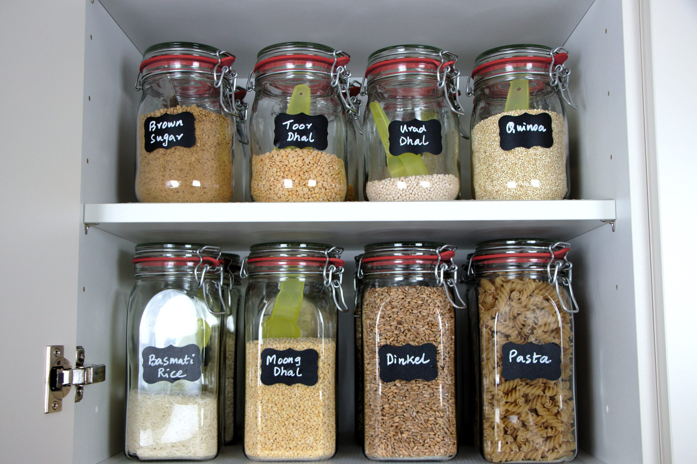

# Modulo 02 · Variabili e strutture decisionali

## A fine lezione:

- Sai distinguere espressioni e istruzioni?
- Sai usare variabili?
- Sai definire la sintassi dell'assegnamento?
- Sai definire la semantica dell'assegnamento?
- Sai leggere input con `input()` e convertire tipi con `int()` e `str()`?
- Sai definire la sintassi dei costrutti `if`, `if-else`, `elif`?
- Sai definire la semantica dei costrutti `if`, `if-else`, `elif`?
- Sai scrivere semplici decisioni con `if`, `if-else`, `elif`?
- Sai organizzare uno script in sezioni leggibili?

## Recap operativo

La scorsa lezione:

- saper usare un interprete Python 3;
- saper scrivere un file `.py` in un editor;
- conoscere tipi fondamentali e confronti.

Per ripassare:

1. dato un numero di secondi `s` convertire in ore, minuti, secondi;
2. data una stringa `s` e un intero `n`, stampare il carattere in posizione `n` insieme al precedente e al successivo.

<details>
- attenzione alle parentesi superflue: una stringa resta una stringa anche senza "impacchettarla" ulteriormente. Aggiungerle può cambiare il modo in cui un interprete o un ambiente legge l'espressione;
- conviene scrivere l'operazione nel modo più semplice che conserva il tipo giusto. -- `type()`
</details>

## Struttura di uno script

Nel modulo 1 abbiamo scritto i primi file `.py` e introdotto `print()`.
Qui vediamo come organizzare uno script un po' più articolato.

### Struttura minima di uno script

Una convenzione pratica utile per organizzare file un po' meno banali è questa.

In generale uno script tende ad avere tre blocchi:

1. intestazione e commenti generali;
2. eventuali `import` di librerie esterne;
3. definizione di funzioni e poi corpo principale del programma.

Esempio schematico:

```python
# autore, data, scopo dello script

import sys

def capitalizza(s):
    '''
    funzione che data una stringa `s` restituisce la stessa stringa con l'iniziale maiuscola e
    il resto dei caratteri minuscoli
    '''
    return s[0].upper() + s[1:].lower()

# corpo principale
nome = input("Nome: ")
print(capitalizza(nome))
```

> rendiamo il codice più leggibile per noi e per chi lo rileggerà dopo.

### Commenti

Vale anche questa osservazione:

- le righe che iniziano con `#` sono commenti;
- i commenti non vengono eseguiti dall'interprete;
- servono a spiegare struttura, scopo e scelte del codice;
- blocchi di testo descrittivo possono comparire anche come stringhe multilinea usate come documentazione.

## Espressioni e istruzioni

Tutte le operazioni che abbiamo visto fino adesso (lasciamo stare `print()` per un attimo) sono **espressioni**: l'interprete Python valuta, la CPU esegue dei calcoli e otteniamo un valore (**NB: con un suo un tipo**).

Esempi:

- `3 // 4`
- `"ciao".upper()`
- `"ciao"+" "+"mondo!"`

Un linguaggio formale è fatto anche di **istruzioni**: un comando che provoda un effetto sulla memoria gestita dal programma.

## Variabili, assegnamento e stato

Con la sola REPL possiamo calcolare un valore, ma lo perdiamo subito.

Per esempio:

```python
3 + 4
```

calcola `7`, ma cosa succede se vogliamo riutilizzare quel risultato più avanti?

Per esempio vogliamo:

- considerare la temperatura di oggi in gradi centigradi (23 gradi)
- stampare il suo equivalente in gradi Kelvin
- stampare il suo equivalente in gradi Farenheit

```python
print(23 + 273.15)           # Kelvin
print(23 * 9/5 + 32)         # Fahrenheit
```

Nei programmi reali i valori cambiano, devono essere memorizzati e riutilizzati.
Senza un modo per conservare i risultati, il programma sarebbe limitato a calcoli “usa e getta”.

Problemi del codice precedente:

- Se la temperatura cambia (es. 25 gradi), devi ricordarti di cambiare tutti i 23
- Chi legge il codice non sa subito cosa rappresenta 23
- Non puoi usare facilmente quel valore in altre parti del programma

Per risolvere questo problema, usiamo le variabili.

```python
temperatura = 23

print(temperatura + 273.15)
print(temperatura * 9/5 + 32)
```

Una variabile è un “contenitore” che permette di:

- salvare un valore
- dargli un nome
- riutilizzarlo in seguito

## Sintassi dell'assegnamento

Forma generale:

```python
nome_variabile = espressione
```

Parti da riconoscere:

- a sinistra c'è il **nome** che vogliamo aggiornare;
- a destra c'è un valore oppure un'**espressione** da valutare;
- il simbolo `=` in Python introduce un'assegnazione.

Regole pratiche per il nome di una variabile:

- deve iniziare con una lettera oppure con `_`;
- dal secondo carattere in poi può contenere lettere, cifre e `_`;
- non può contenere spazi;
- non può iniziare con una cifra;
- non può essere una parola riservata di Python come `if`, `for`, `while`.

Esempi di nomi validi:

```python
eta
nome_studente
_contatore
voto2
```

Esempi di nomi non validi:

```python
2voto
nome studente
if
```

> **Attenzione:** in programmazione `=` non significa "e' uguale a" nel senso della matematica.
> Significa invece "assegna alla variabile di sinistra il valore calcolato a destra".

Per questo:

```python
x = 3
```

è corretto, mentre:

```python
3 = x
```

non ha senso, perchè a sinistra dell'assegnamento deve esserci un nome di variabile, non un numero.

Esempi:

```python
eta = 20
nome = "Luca"
totale = prezzo + iva
```

## Semantica dell'assegnamento

Quando Python legge:

```python
somma = 4 + 3
```

succede questo:

1. valuta l'espressione a destra;
2. ottiene un risultato;
3. associa quel risultato al nome a sinistra;
4. aggiorna lo stato del programma.



Da questo momento quei valori non sono più "persi": sono disponibili attraverso i nomi delle variabili.
Quindi una variabile può comparire a destra dentro una nuova espressione.

Per esempio:

```python
y = 3 + 1
x = y + 2
```

Qui Python:

- valuta `3 + 1` e assegna il risultato a `y`;
- legge il valore attualmente associato a `y`;
- calcola `y + 2`;
- assegna il risultato a `x`.

### Conseguenze importanti!

```python
x = x + 1
```

non è una formula matematica, ma un aggiornamento di stato:

- leggi il valore attuale di `x`;
- aggiungi `1`;
- salva il nuovo valore nella variabile `x`.

## Tracciare dati, memoria e output

Lo **stato** di un programma non riguarda il testo che scriviamo nel file, ma il programma mentre viene eseguito.
È l'insieme dei valori che, in un certo momento dell'esecuzione, sono conservati in memoria e disponibili.
In questo modulo, in pratica, lo stato coincide soprattutto con i valori associati alle variabili.

Tracciare un programma significa simulare a mano che cosa succede riga per riga, tenendo traccia dello stato delle variabili e di quello che viene stampato.

Dobbiamo abituarci a distinguere tre cose:

- il valore che Python calcola e conserva in memoria;
- l'output che Python stampa (visibile solo se si usa `print()`);
- l'ordine in cui le istruzioni vengono eseguite.

per esempio:

```python
x = 4
print("ciao" + " " + "mondo")
print(x)
y = x + 3
```

Una tabella minima può contenere:

| Passo | Istruzione                      | Stato della memoria | Output       |
| ----- | ------------------------------- | ------------------- | ------------ |
| 1     | `x = 4`                         | `x → 4`             |              |
| 2     | `print("ciao" + " " + "mondo")` | `x → 4`             | `ciao mondo` |
| 3     | `print(x)`                      | `x → 4`             | `4`          |
| 4     | `y = x + 3`                     | `x → 4, y → 7`      |              |


### Esempio guidato

```python
x = 10
y = x // 3
print(y)
```

Traccia:

| Passo             | Stato della memoria | Output |
| ----------------- | ------------------- | ------ |
| dopo `x = 10`     | `x = 10`            |        |
| dopo `y = x // 3` | `x = 10`, `y = 3`   |        |
| dopo `print(y)`   | `x = 10`, `y = 3`   | `3`    |

## `input()`, e casting

Torniamo all'esempio della temperatura:

```python
temperatura = 23

print(temperatura + 273.15)
print(temperatura * 9/5 + 32)
```

Abbiamo un altro problema: se vogliamo eseguire questo script ogni giorno, dobbiamo aprire l'**editor** e modificare manualmente il valore 23.
Vorremmo fare sì che questo valore diventi un **parametro** del nostro programma in modo da poter eseguire ogni giorno lo script e vedere la temperatura in gradi Kelvin e Farenheit sul nostro schermo.

Abbiamo gia' visto `print()` nel modulo 1.
Qui introduciamo il suo complemento: `input()`.

`input()` è un comando utile per leggere un valore scritto dall'utente mentre il programma è in esecuzione.
Il testo che mettiamo tra parentesi è il **parametro** della funzione: serve a mostrare un messaggio sullo schermo, per esempio una domanda o un'istruzione.

## Sintassi di assegnamento con `input()`

Forma tipica:

```python
variabile = input("Messaggio: ")
```

Qui:

- `input(...)` legge qualcosa scritto dall'utente;
- `"Messaggio: "` è il parametro passato a `input()`;
- il valore letto viene assegnato alla variabile a sinistra.

Esempi:

```python
nome = input("Come ti chiami? ")
print(nome)
eta = input("Eta': ")
print(eta)
```

Possiamo usare `input()` anche senza messaggio:

```python
testo = input()
```

## Semantica di `input()`

`input()` mostra il messaggio, aspetta che l'utente scriva qualcosa e si ferma quando l'utente preme Invio, cioè inserisce un ritorno a capo.
Solo a quel punto restituisce il testo letto.
Il risultato di `input()` è sempre una **stringa**.

```python
nome = input("Come ti chiami? ")
print("Ciao", nome)
```

| Passo | Istruzione                         | Stato della memoria | Output             |
| ----- | ---------------------------------- | ------------------- | ------------------ |
| 1     | `nome = input("Come ti chiami? ")` | `nome → "Ludovica"`   | `Come ti chiami? ` |
| 2     | `print("Ciao", nome)`              | `nome → "Ludovica"`   | `Ciao Ludovica`    |

Succede questo:

1. Python mostra il prompt;
2. l'utente scrive qualcosa;
3. `input()` restituisce quel testo;
4. quel testo viene salvato nella variabile;
5. il programma può continuare a usarlo.

### Casting

Problema:

```python
eta = input("Età: ")
print(eta + 1)
```

<details>
<summary>Cosa succede?</summary>
```
Traceback (most recent call last):
  File "<stdin>", line 1, in <module>
    print(eta + 1)
          ~~~~^~~
TypeError: can only concatenate str (not "int") to str
```

| Passo | Istruzione             | Stato della memoria | Output     |
| ----- | ---------------------- | ------------------- | ---------- |
| 1     | `eta = input("Età: ")` | `eta → "33"`        | `Età: `    |
| 2     | `print(eta + 1)`       | `eta → "33"`        | !!! ERRORE |

</details>

Versione corretta:

```python
eta = input("Eta': ")
print(int(eta) + 1)
```

Alcune conversioni comuni:

| Funzione       | Effetto                     |
| -------------- | --------------------------- |
| `int("12")`    | converte in intero          |
| `str(12)`      | converte in stringa         |
| `float("3.5")` | converte in numero decimale |

Questa operazione di conversione di chiama **casting**.


## Esercizi

1. Scrivi un programma che legge nome e cognome e stampa un saluto, per esempio `Ciao, Mario Rossi!`.

2. Scrivi un programma che legge l'età e stampa: `Tra un anno avrai X anni` e `Un anno fa avevi Y anni`.

3. Scrivi un programma che legge due numeri interi e stampa la loro somma, il loro prodotto e il resto della divisione del primo per il secondo.

4. Scrivi un programma che legge tre numeri e ne stampa la media.

5. Scrivi un programma che legge una stringa e stampa:
   - la lunghezza della stringa;
   - il primo carattere;
   - l'ultimo carattere;
   - i primi tre caratteri.

6. Scrivi un programma che legge due numeri e stampa prima i valori inseriti e poi gli stessi valori scambiati.

7. Scrivi un programma che legge un nome e un anno di nascita e stampa una frase del tipo: `Ciao Anna, potresti avere 20 o 21 anni`.

8. Scrivi un programma che legge un numero intero di secondi (es. `3723`) e stampa la conversione nel formato: `1 ore, 2 minuti, 3 secondi`.

9. Scrivi un programma che legge nome e cognome e stampa:
    - il cognome tutto in maiuscolo;
    - il nome con solo la prima lettera maiuscola e il resto minuscolo;
    - le iniziali nel formato `M.R.`

10. Scrivi un programma che legge una stringa e stampa:
    - la stringa senza il primo e l'ultimo carattere;

11. Scrivi un programma che legge un prezzo in euro (numero decimale) e una percentuale di sconto (numero intero, es. `20`), e stampa il prezzo scontato e il risparmio.

## Tipo `bool` e nuove operazioni

Fin qui abbiamo lavorato con interi, stringhe e `float`.
Ora introduciamo nuove operazioni che non producono un numero o una stringa, ma un valore booleano.

Per esempio possiamo controllare:

- se due valori sono uguali;
- se un numero è maggiore di un altro;

Esempi:

```python
3 > 1
2.5 <= 7.0
"anna" == "anna"
"ciao" != "buongiorno"
```

Queste operazioni non restituiscono un intero, un `float` o una stringa.
Restituiscono invece un **valore booleano**, cioè un valore che rappresenta il risultato di un confronto.

Il tipo `bool` ha due soli valori possibili:

- `True`
- `False`

Operatori di confronto che restituiscono un valore booleano:

| Operazione | Significato         | Esempio  |
| ---------- | ------------------- | -------- |
| `==`       | uguale a            | `x == 3` |
| `!=`       | diverso da          | `x != 3` |
| `<`        | minore di           | `x < 3`  |
| `<=`       | minore o uguale a   | `x <= 3` |
| `>`        | maggiore di         | `x > 3`  |
| `>=`       | maggiore o uguale a | `x >= 3` |

### Altre operazioni che restituiscono booleani

Anche alcune operazioni sulle stringhe restituiscono `True` oppure `False`.

Per esempio:

| Operazione            | Significato                                                  | Esempio                   |
| --------------------- | ------------------------------------------------------------ | ------------------------- |
| `in`                  | controlla se una sottostringa compare dentro una stringa     | `"cia" in "ciao"`         |
| `not in`              | controlla se una sottostringa non compare dentro una stringa | `"x" not in "ciao"`       |
| `s.startswith("...")` | controlla se la stringa inizia con un certo prefisso         | `"ciao".startswith("ci")` |
| `s.endswith("...")`   | controlla se la stringa finisce con un certo suffisso        | `"ciao".endswith("ao")`   |
| `s.isdigit()`         | controlla se tutti i caratteri sono cifre                    | `"123".isdigit()`         |
| `s.isalpha()`         | controlla se tutti i caratteri sono lettere                  | `"ciao".isalpha()`        |

Anche queste operazioni possono essere usate dentro una condizione `if`.

Quando tracciamo o eseguiamo il programma, anche questi valori vanno rappresentati nello stato, proprio come interi, stringhe e `float`.

## Condizionare il flusso del programma

Con i booleani possiamo decidere il flusso di esecuzione.

Fin qui tutti in tutti i programmi che abbiamo visto le istruzioni vengono eseguite tutte e nell'ordine in cui le abbiamo scritte.

Ma molti problemi chiedono una scelta:

- se il numero è positivo, fai una cosa;
- se il nome viene prima alfabeticamente, stampa in un certo ordine;
- se l'input non è valido, reagisci in modo diverso.

Per gestire queste biforcazioni serve un costrutto condizionale.

## Sintassi di `if`

```python
if [espressione_booleana]:
    istruzione-1
    istruzione-2
    ...
    istruzione-k
```

- La parola chiave `if` introduce una condizione;
- dopo `if` c'è un'espressione booleana;
- la prima riga è conclusa da due punti `:` che aprono un blocco;
- il blocco di istruzioni da `1` a `k` va indentato.

## Semantica di `if`

```python
if [espressione_booleana]:
    istruzione-1
    istruzione-2
    ...
    istruzione-k
```

1. L'interprete valuta l'**espressione** booleana;
2. se vale `True`, esegue il blocco indentato;
3. se vale `False`, salta quel blocco e continua dopo.

## Esempi

```python
x = input("Inserisci la tua età: ")
x = int(x)

if x > 18:
    print("Sei maggiorenne")

print("Hai "+str(x)+" anni")
```

<details>
<summary>Esecuzione n.1</summary>

| Passo | Istruzione                            | Stato della memoria | Output                   |
| ----- | ------------------------------------- | ------------------- | ------------------------ |
| 1     | `x = input("Inserisci la tua età: ")` | `x → "33"`          | `Inserisci la tua età: ` |
| 2     | `x = int(x)`                          | `x → 33`            |                          |
| 3     | `if x > 18:`                          | `x → 33` →→→ TRUE   |                          |
| 4     | `print("Sei maggiorenne")`            | `x → 33`            | `Sei maggiorenne!`       |
| 5     | `print("Hai "+str(x)+" anni")`        | `x → 33`            | `Hai 33 anni`            |

</details>

<details>
<summary>Esecuzione n.2</summary>

| Passo | Istruzione                            | Stato della memoria | Output                   |
| ----- | ------------------------------------- | ------------------- | ------------------------ |
| 1     | `x = input("Inserisci la tua età: ")` | `x → "15"`          | `Inserisci la tua età: ` |
| 2     | `x = int(x)`                          | `x → 15`            |                          |
| 3     | `if x > 18:`                          | `x → 15` →→→ FALSE  |                          |
| 4     | `print("Hai "+str(x)+" anni")`        | `x → 15`            | `Hai 15 anni`            |

</details>

## `if-else` e `if` annidati

Con `if` semplice possiamo eseguire un blocco solo quando una condizione e vera.
Pero' spesso vogliamo descrivere anche che cosa succede quando quella stessa condizione e' falsa.

Per questo usiamo `if-else`, che separa esplicitamente due rami alternativi.
Quando invece una decisione deve essere presa all'interno di un altro ramo, useremo `if` annidati.

Se i casi possibili sono piu' di due ma restano sullo stesso livello, useremo `elif`.

## Sintassi di `if-else`

```python
if [espressione_booleana]:
    istruzione-1
    ...
    istruzione-j
else:
    istruzione-1
    ...
    istruzione-k
```

Qui ci sono due blocchi alternativi:

- il blocco dopo `if`;
- il blocco dopo `else`.

`else` non ha una condizione propria: raccoglie tutti i casi in cui la condizione dell'`if` vale `False`.


## Semantica di `if-else`

```python
if [espressione_booleana]:
    istruzione-1
    ...
    istruzione-j
else:
    istruzione-1
    ...
    istruzione-k
```

Con `if-else` Python:

1. valuta la condizione dell'`if`;
2. se vale `True`, esegue il primo blocco;
3. se vale `False`, esegue il blocco `else`.

Quindi tra i due rami se ne esegue sempre uno solo.

## Esempi:

```python
x = input("Inserisci la tua età: ")
x = int(x)

if x > 18:
    print("Sei maggiorenne")
else:
    print("Sei minorenne")

print("Hai "+str(x)+" anni")
```

<details>
<summary>Esecuzione n.1</summary>

| Passo | Istruzione                            | Stato della memoria | Output                   |
| ----- | ------------------------------------- | ------------------- | ------------------------ |
| 1     | `x = input("Inserisci la tua età: ")` | `x → "33"`          | `Inserisci la tua età: ` |
| 2     | `x = int(x)`                          | `x → 33`            |                          |
| 3     | `if x > 18:`                          | `x → 33` →→→ TRUE   |                          |
| 4     | `print("Sei maggiorenne")`            | `x → 33`            | `Sei maggiorenne!`       |
| 5     | `print("Hai "+str(x)+" anni")`        | `x → 33`            | `Hai 33 anni`            |

</details>

<details>
<summary>Esecuzione n.2</summary>

| Passo | Istruzione                            | Stato della memoria | Output                   |
| ----- | ------------------------------------- | ------------------- | ------------------------ |
| 1     | `x = input("Inserisci la tua età: ")` | `x → "15"`          | `Inserisci la tua età: ` |
| 2     | `x = int(x)`                          | `x → 15`            |                          |
| 3     | `if x > 18:`                          | `x → 15` →→→ FALSE  |                          |
| 4     | `print("Sei minorenne")`              | `x → 15`            | `Sei minorenne`          |
| 5     | `print("Hai "+str(x)+" anni")`        | `x → 15`            | `Hai 15 anni`            |

</details>

## A volte due rami non bastano

Non si diventa maggiorenni in tutto il mondo alla stessa età!

- se hai più di 21 anni, sei maggiorenne in USA
- se hai meno di 21 anni, ma più di 18, sei maggiorenne in Italia
- se hai meno di 18 anni, non sei maggiorenne nè in Italia nè in USA.

In questi casi vorremmo una catena di controlli ordinati.

```python
x = input("Inserisci la tua età: ")
x = int(x)

if x > 21:
    print("Sei maggiorenne in USA")
else:
    if x > 18:
        print("Sei maggiorenne in Italia ma non in USA")
    else:
        print("Sei minorenne")
```

Questa cascata di `if` inclusi negli `else` può diventare poco leggibile...

## `if-elif-else`

```python
if [espressione_booleana]:
    istruzione
elif [espressione_booleana]:
    istruzione
elif [espressione_booleana]:
    istruzione
else:
    istruzione
```

Ogni `elif` aggiunge una nuova condizione.

L'interprete controlla i rami in ordine:

1. prova la condizione dell'`if`;
2. se è falsa, prova il primo `elif`;
3. continua finché trova la prima condizione vera;
4. se nessuna è vera, esegue `else`.

Quindi:

- conta l'ordine dei rami;
- viene eseguito solo il primo ramo che risulta vero;
- `else` copre il caso residuo.

## Esercizi

1. Leggi un numero intero e stampa `Positivo` solo se è maggiore di zero.
2. Leggi una parola e stampa `La parola è lunga` solo se ha più di 5 caratteri.
3. Leggi un numero intero e stampa `Pari` solo se è divisibile per 2.
4. Leggi un numero intero e stampa `Pari` oppure `Dispari` a seconda se è divisibile per due o meno.
5. Leggi due numeri interi e stampa il maggiore o un messaggio se sono uguali.
6. Leggi due nomi e stampali nell'ordine alfabetico corretto.
7. Leggi una parola e controlla se inizia con una vocale; stampa un messaggio diverso nei due casi.
8. Leggi un numero intero e stampa `Negativo`, `Zero` o `Positivo`.
9. Leggi un voto da 0 a 30 e stampa:
   - `Insufficiente` se il voto è minore di 18;
   - `Sufficiente` se è tra 18 e 23;
   - `Buono` se è tra 24 e 27;
   - `Ottimo` se è 28 o più.
10. Leggi una parola e stampa se è corta (meno di 4 lettere), media (da 4 a 7 lettere) o lunga (più di 7 lettere).

11. Leggi una coppia di numeri che rappresentano un mese (1–12) e un anno e stampa il mese successivo con l'anno corretto.
    Per esempio: mese 12, anno 2024 → `Gennaio 2025`.

12. Leggi nome, cognome e anno di nascita. Stampa sempre il nome completo e l'anno di nascita. Se l'anno di nascita è precedente al 2000, stampa anche `Nato/a nel secolo scorso`.

13. Leggi due numeri interi. Stampa sempre entrambi i numeri.
    Se il primo è maggiore del secondo, stampa anche `Il primo è maggiore`.
    Stampa sempre anche la loro somma.

14. Leggi una parola. Se ha più di 3 caratteri, stampa il secondo carattere; altrimenti stampa `Parola troppo corta`. In entrambi i casi stampa alla fine la lunghezza della parola.

15. Leggi una parola. Costruisci una variabile `risultato`:
    - se la parola inizia con una lettera maiuscola, `risultato` vale `"maiuscola"`;
    - altrimenti vale `"minuscola"`.
    Stampa `La parola è: ` seguito da `risultato`.

16. Leggi un numero intero. Costruisci una variabile `messaggio`:
    - se il numero è pari, `messaggio` vale `"pari"`;
    - altrimenti vale `"dispari"`.
    Stampa `Il numero X è` seguito da `messaggio`.

17. Leggi due numeri interi `a` e `b`. Se `a` è maggiore di `b`, scambia i valori delle due variabili.
Stampa sempre `a` e `b` alla fine: i valori usciti devono essere in ordine crescente.

### Esercizi di traccia

Per ciascun programma e input indicato, cerca di predire l'output del programma con gli input proposti e compila la tabella con lo stato della memoria.

**T1.**

```python
x = int(input("x: "))
y = int(input("y: "))
z = x + y
if z > 10:
    x = x * 2
    etichetta = "grande"
elif z > 0:
    x = x + 1
    etichetta = "medio"
else:
    etichetta = "piccolo"
print(etichetta + ": " + str(x))
```

- Traccia con input `3`, `4`
- Traccia con input `6`, `7`

**T2.**

```python
s = input("Parola: ")
n = len(s)
if n > 4:
    s = s[0].upper() + s[1:]
    risultato = s + " (" + str(n) + ")"
else:
    risultato = s.upper()
print(risultato)
```

- Traccia con input `"python"`
- Traccia con input `"ciao"`

**T3.**

```python
a = int(input("a: "))
b = int(input("b: "))
if a > b:
    tmp = a
    a = b
    b = tmp
diff = b - a
if diff > 5:
    messaggio = "distanti"
else:
    messaggio = "vicini"
print(str(a) + " " + str(b) + " - " + messaggio)
```

- Traccia con input `9`, `2`


**T4.**

```python
n = int(input("n: "))
print("Inizio")
if n < 0:
    print("Negativo")
    n = -n
    print("Valore assoluto: " + str(n))
elif n == 0:
    print("Zero")
else:
    print("Positivo")
    n = n * n
print("Fine: " + str(n))
```

- Traccia con input `-3`
- Traccia con input `4`

**T5.**

```python
a = int(input("a: "))
b = int(input("b: "))
print("a=" + str(a) + " b=" + str(b))
if a > b:
    print("a è maggiore")
    diff = a - b
    print("Differenza: " + str(diff))
else:
    print("b è maggiore o uguale")
    diff = b - a
print("Distanza: " + str(diff))
```

- Traccia con input `a = 7`, `b = 2`
- Traccia con input `a = 3`, `b = 3`
