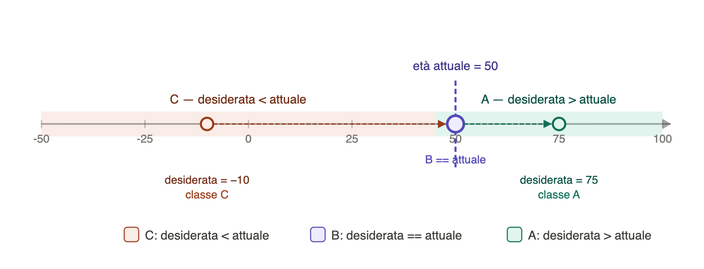
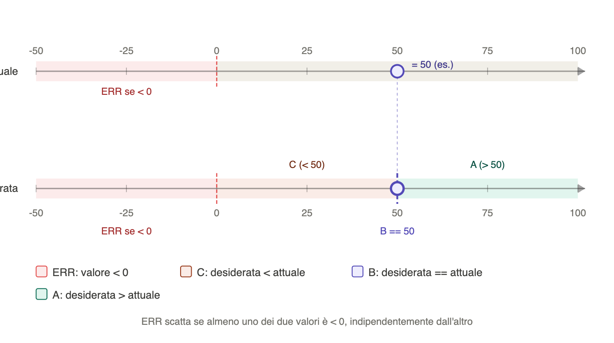

# Modulo 03 · Testare il programma e operazioni su booleani

## A fine lezione

- Sai tracciare lo stato del programma durante l'esecuzione?
- Sai riconoscere errori frequenti e localizzarli?
- Sai usare casi di test per smascherare errori logici?
- Sai usare condizioni composte con attenzione?
- Sai applicare le leggi di De Morgan?
- Sai modellare piccoli problemi con automi a stati finiti?
- Sai ragionare sui casi limite anche quando il codice sembra plausibile a prima vista?

## Errori nel codice

Abbiamo scritto dei programmi!
Ma saranno corretti?

**Caso 1:** il programma genera un errore

**Caso 2:** il programma termina l'esecuzione senza generale alcun errore

## Primi messaggi di errore

Un messaggio di errore contiene almeno tre informazioni utili:

| Informazione   | Domanda                                 |
| -------------- | --------------------------------------- |
| tipo di errore | che genere di problema e`?              |
| riga segnalata | dove si manifesta?                      |
| contesto       | quale operazione stava tentando Python? |

Esempi frequenti:

| Errore        | Causa tipica                      |
| ------------- | --------------------------------- |
| `SyntaxError` | sintassi non valida               |
| `NameError`   | nome di variabile non definito    |
| `TypeError`   | operazione tra tipi incompatibili |
| `ValueError`  | conversione non possibile         |

### Esercizi

Per ciascun programma: esegui il codice, individua il tipo di errore che produce e la riga in cui compare, poi spiega perché si verifica e correggi il codice di conseguenza.

**E1.**

```python
nome = input("Nome: ")
cognome = input("Cognome: ")
eta = input("Età: ")
print("Ciao " + nome + " " + cognome + "!")
print("Tra dieci anni avrai " + eta + 10 + " anni.")
```

**E2.**

```python
anno_nascita = input("Anno di nascita: ")
anno_corrente = 2025
eta = anno_corrente - anno_nascita
print("Hai circa " + str(eta) + " anni.")
```

**E3.**

```python
parola = input("Parola: ")
lunghezza = len(parola)
print("La parola ha " + lunghezza + " lettere.")
```

**E4.**

```python
x = int(input("Numero: "))
if x > 0:
    segno = "positivo"
elif x < 0:
    segno = "negativo"
print("Il numero è " + segno)
```

## Testing e casi limite

Anche se il programma non genera un errore, potrebbe comunque fare la cosa sbagliata: non basta che l'esecuzione si concluda per dire che "funziona".
Bisogna confrontare input e output attesi su casi scelti apposta.

Consideriamo questo programma, scritto per stampare un numero con il suo segno esplicito (`+7`, `-3`, `0`):

```python
n = int(input("Numero: "))
if n > 0:
    segno = "+"
else:
    segno = "-"
print(segno + str(n))
```

Proviamolo su diversi input:

| Input  | Output atteso | Output reale |
| ------ | ------------- | ------------ |
| `7`    | `+7`          | ?            |
| `-3`   | `-3`          | ?            |
| `0`    | `0`           | ?            |

Sembra ragionevole: il ramo `if` (se maggiore di 0) aggiunge `+`, il ramo `else` aggiunge `-`.

Ma `str(-3)` restituisce già `"-3"`: concatenarci davanti un altro `"-"` produce `"--3"`.
E per `0`, il ramo `else` produce `"-0"` invece di `"0"`.

Il programma non genera nessun errore, ma l'output è sbagliato per tutti i numeri non positivi.

**Perché succede:** `str(n)` su un numero negativo include già il segno meno.
Aggiungere `"-"` davanti raddoppia il segno.

**Correzione:**

```python
n = int(input("Numero: "))
if n > 0:
    print("+" + str(n))
elif n < 0:
    print(str(n))  # str(n) contiene già il segno
else:
    print("0")
```

## Metodo

1. scegli un input piccolo;
2. scrivi l'output atteso;
3. esegui il programma;
4. confronta il risultato reale con quello previsto;
5. se modifichi il codice, ripeti gli stessi test.

## Esercizi: if/elif/else e testing

Per ognuno degli esercizi seguenti il metodo è sempre lo stesso:

1. **scrivi i desiderata** — prima di eseguire il codice, compila la tabella con l'output che ti aspetti per ogni input;
2. **esegui e controlla** — lancia il programma con quegli input e annota l'output reale;
3. **confronta** — dove differiscono, spiega perché.

### Esercizio 1

Il programma riceve un numero intero e stampa `"pari"` se è pari, `"dispari"` se è dispari.

| Input | Output atteso | Output reale |
| ----- | ------------- | ------------ |
| `0`   |               |              |
| `3`   |               |              |
| `-4`  |               |              |
| `7`   |               |              |

<details>
```python
n = int(input("Numero: "))
if n > 0 and n % 2 == 0:
    print("pari")
else:
    print("dispari")
```
</details>

### Esercizio 2

Il programma riceve un voto e stampa `"promosso"` se è almeno 18, `"non promosso"` altrimenti.

| Input | Output atteso | Output reale |
| ----- | ------------- | ------------ |
| `15`  |               |              |
| `30`  |               |              |
| `18`  |               |              |

<details>

```python
voto = int(input("Voto: "))
if voto >= 18:
    print("promosso")

if voto <= 18:
    print("non promosso")
```

</details>


### Esercizio 3

Il programma riceve un numero intero e stampa `"positivo"` se è maggiore di zero, `"grande"` se è maggiore di 10, `"non positivo"` negli altri casi.

| Input | Output atteso | Output reale |
| ----- | ------------- | ------------ |
| `5`   |               |              |
| `15`  |               |              |
| `-2`  |               |              |


<details>

```python
x = int(input("x: "))
if x > 0:
    print("positivo")
elif x > 10:
    print("grande")
else:
    print("non positivo")
```

</details>

### Esercizio 4

Il programma riceve un intero e stampa `"fizz"` se è divisibile per 3, `"buzz"` se è divisibile per 5, `"fizzbuzz"` se è divisibile per entrambi, il numero stesso negli altri casi.

| Input | Output atteso | Output reale |
| ----- | ------------- | ------------ |
| `1`   |               |              |
| `3`   |               |              |
| `5`   |               |              |
| `15`  |               |              |
| `9`   |               |              |

Scrivi il programma e testane il funzionamento.

## Comporre condizioni

Fino adesso abbiamo visto operazioni che confrontano ad esempio numeri interi e restituiscono un valore booleano. Ma esistono anche operazioni che agiscono direttamente su valori booleani.

In particolare consideriamo tre operazioni:

- `and`
- `or`
- `not`

## Sintassi di `and`, `or`, `not`

Forme generali:

```python
espressione_booleana and espressione_booleana
```

```python
espressione_booleana or espressione_booleana
```

```python
not espressione_booleana
```

Queste operazioni si usano per costruire condizioni più complesse a partire da condizioni più semplici.

Esempi:

```python
x > 0 and x < 10
eta >= 18 or ha_permesso
not nome == "Ludovica"
```

## Semantica di `and`, `or`, `not`

Queste operazioni prendono in ingresso valori booleani e restituiscono a loro volta un valore booleano.

### Semantica di `and`

```python
A and B
```

vale `True` solo quando **entrambe** le condizioni sono vere.
Se almeno una delle due è falsa, il risultato è `False`.

Per esempio:

```python
x > 0 and x < 10
```

significa: "x è maggiore di 0 e contemporaneamente minore di 10".

### Tavola di verità di `and`

| x | y | x and y |
| --- | --- | --- |
| `False` | `False` | `False` |
| `False` | `True` | `False` |
| `True` | `False` | `False` |
| `True` | `True` | `True` |

### Semantica di `or`

```python
A or B
```

vale `True` quando **almeno una** delle due condizioni è vera.
Vale `False` solo quando sono false entrambe.

Per esempio:

```python
voto < 18 or voto > 30
```

significa: "il voto è fuori dall'intervallo valido", potrebbe esserlo perché minore di 18 o perché maggiore di 30.

### Tavola di verità di `or`

| x | y | x or y |
| --- | --- | --- |
| `False` | `False` | `False` |
| `False` | `True` | `True` |
| `True` | `False` | `True` |
| `True` | `True` | `True` |

### Semantica di `not`

```python
not A
```

inverte il valore booleano della condizione:

- se `A` vale `True`, allora `not A` vale `False`;
- se `A` vale `False`, allora `not A` vale `True`.

Per esempio:

```python
not x > 0
```

significa: "non è vero che x è maggiore di 0", equivale a `x<=0`.

### Tavola di verità di `not`

| x | not x |
| --- | --- |
| `False` | `True` |
| `True` | `False` |

## Esercizi

### Valutare espressioni booleane

Per ciascuna espressione e valori di variabili indicati, calcola il risultato (`True` o `False`) senza eseguire il codice.

1. `x = 5`, `y = 3` → `x > 0 and y > 0`
2. `x = -2`, `y = 4` → `x > 0 and y > 0`
3. `x = -2`, `y = 4` → `x > 0 or y > 0`
4. `x = -2`, `y = -1` → `x > 0 or y > 0`
5. `n = 7` → `not n > 10`
6. `n = 15` → `not n > 10`
7. `eta = 20`, `ha_documento = False` → `eta >= 18 and ha_documento`
8. `eta = 16`, `ha_documento = True` → `eta >= 18 or ha_documento`

### Condizioni composte nei programmi

1. Scrivi un programma che legge un numero intero e stampa `Nel range` se è compreso tra 1 e 100 (estremi inclusi), `Fuori range` altrimenti.
2. Un anno è bisestile se è divisibile per 4 ma non per 100, oppure se è divisibile per 400. Scrivi un programma che verifica questa condizione
3. Scrivi un programma che legge due stringhe e stampa `Almeno una è vuota` se almeno una delle due ha lunghezza zero, altrimenti stampa `Entrambe non vuote`.
4. Scrivi un programma che legge un numero intero e stampa `Fuori range` se è minore di 0 oppure maggiore di 10. Poi riscrivi la stessa condizione usando `not` e `and`.
5. Scrivi un programma che legge nome, età attuale ed età da raggiungere. Il programma stampa un saluto, la tua età attuale e tra quanti anni raggiungerai l'età desiderata.
    - Ad esempio Maria ha 10 anni e vuole averne 18, il programma stamperà:
      `Ciao Maria, oggi hai 10 anni, tra 8 anni ne avrai 18 come desideri`

## Ordine di precedenza degli operatori

Quando una condizione contiene più operatori, Python non legge tutto "da sinistra a destra" in modo piatto.
Usa invece un **ordine di precedenza**, cioè alcune operazioni vengono valutate prima di altre.

Nelle espressioni che useremo più spesso vale questa regola pratica:

1. parentesi;
2. confronti come `<`, `<=`, `==`, `!=`, `>`, `>=`;
3. `not`;
4. `and`;
5. `or`.

Quindi `not` ha precedenza su `and`, e `and` ha precedenza su `or`.

Esempio:

```python
True or False and False
```

non si legge come:

```python
(True or False) and False
```

ma come:

```python
True or (False and False)
```

perché `and` viene valutato prima di `or`.

Un altro esempio:

```python
not x > 0 and y > 0
```

si legge come:

```python
(not (x > 0)) and (y > 0)
```

Come in matematica, con le parentesi possiamo influenzare l'ordine delle operazioni.

Confronta:

```python
A or B and C
```

con:

```python
(A or B) and C
```

Non sono in generale equivalenti.

## Valutazione lazy

Gli operatori `and` e `or` non valutano sempre entrambe le parti dell'espressione.
Python si ferma appena il risultato finale è già determinato.

Questo comportamento si chiama **valutazione lazy** oppure **short-circuit**.

Partiamo da questo esempio:

```python
x = 5

if x > 0 and y > 0:
    print("Entrambi i numeri positivi!")
```

<details>
Questo codice genera errore, perché `y` non è definita.
</details>

Ora consideriamo questo caso:

```python
x = 5

if x > 0 or y > 0:
    print("Almeno un numero positivo!")
```

Perchè non genera errore?

| `x > 0` | `y > 0` | `x > 0 or y > 0` |
| ------- | ------- | ---------------- |
| `True`  | `False` | `True`           |
| `True`  | `True`  | `True`           |

`x > 0` vale già `True`, e questo basta a rendere vera tutta l'espressione con `or`.
Di conseguenza Python non valuta `y > 0`.

In generale:

- in `A or B`, se `A` vale `True`, Python non valuta `B`;
- in `A and B`, se `A` vale `False`, Python non valuta `B`.

## Leggi di De Morgan

Le condizioni composte compaiono molto presto nei programmi.

Per esempio, se automatizzassimo il controllo degli accessi in discoteca il programma potrebbe somigliare a qualcosa come:

```python
if eta >= 18 and ha_documento:
    print("Accesso consentito")
```

Qui stiamo combinando due condizioni semplici:

- `eta >= 18`
- `ha_documento`

con l'operatore `and`.

Quando entra in gioco `not`, la lettura diventa meno immediata.

Supponiamo che il programma, invece che lasciare entrare, voglia stampare "Accesso non consentito" se:

- l'età è minore di 18, oppure
- non si ha il documento

```python
if eta < 18 or not ha_documento:
    print("Accesso non consentito")
```

Ma questo deve essere equivalente anche alla negazione della condizione precedente!

```python
if not (eta >= 18 and ha_documento):
    print("Accesso non consentito")
```

Le **leggi di De Morgan** servono a riscrivere negazioni di condizioni composte:

| Forma           | Equivalente       |
| --------------- | ----------------- |
| `not (A and B)` | `not A or not B`  |
| `not (A or B)`  | `not A and not B` |

Esempio:

```python
not (x > 0 and y > 0)
```

equivale a:

```python
not x > 0 or not y > 0
```

ovvero:

```python
x <= 0 or y <= 0
```

## Esercizi

Riscrivi ciascuna condizione in forma equivalente usando le leggi di De Morgan, poi verifica con un esempio numerico.

1. `not (x > 0 and y > 0)`
2. `not (a == b or c == d)`
3. `not (eta >= 18 and ha_documento)`

## Casi e tabelle di verità

Prima di scrivere il codice conviene costruire una tabella dei casi:
elencare esplicitamente tutte le combinazioni di input rilevanti e il comportamento atteso per ciascuna.

Questo serve a non dimenticare casi limite e a capire di quanti rami ha bisogno il programma.

**Esempio:** esercizio 13 — nome, età attuale, età da raggiungere.

Quali combinazioni di input esistono?

Prima versione della tabella — solo i casi "normali":

| Confronto                       | Esempio               | Output atteso                                                        |
| ------------------------------- | --------------------- | -------------------------------------------------------------------- |
| `eta_desiderata > eta_attuale`  | attuale=10, target=18 | `Ciao Maria, oggi hai 10 anni, tra 8 anni ne avrai 18 come desideri` |
| `eta_desiderata == eta_attuale` | attuale=18, target=18 | `Ciao Maria, hai già 18 anni come desideri`                          |
| `eta_desiderata < eta_attuale`  | attuale=25, target=18 | `Ciao Maria, hai già superato i 18 anni`                             |

La tabella mostra che servono tre rami: `if`, `elif`, `else`.
Costruirla prima evita di accorgersi del caso `==` solo dopo aver scritto il codice.

Ma cosa succede se l'utente inserisce un'età negativa?

| Input                          | Esempio               | Comportamento del programma    | Corretto? |
| ------------------------------ | --------------------- | ------------------------------ | --------- |
| `eta_attuale < 0`              | attuale=-5, target=18 | entra nel ramo `>`             | no        |
| `eta_desiderata < 0`           | attuale=10, target=-3 | entra nel ramo `<`             | no        |
| entrambe negative, uguali      | attuale=-5, target=-5 | entra nel ramo `==`            | no        |

Il programma non genera errori ma produce output privi di senso.
Per gestirlo correttamente bisogna aggiungere una validazione degli input **prima** di tutto il resto:

```python
nome = input("Nome: ")
eta_attuale = int(input("Età attuale: "))
eta_desiderata = int(input("Età desiderata: "))

if eta_attuale < 0 or eta_desiderata < 0:
    print("Errore: le età non possono essere negative.")
elif eta_desiderata > eta_attuale:
    anni_mancanti = eta_desiderata - eta_attuale
    print("Ciao " + nome + ", oggi hai " + str(eta_attuale) + " anni, tra " + str(anni_mancanti) + " anni ne avrai " + str(eta_desiderata) + " come desideri")
elif eta_desiderata == eta_attuale:
    print("Ciao " + nome + ", hai già " + str(eta_desiderata) + " anni come desideri")
else:
    print("Ciao " + nome + ", hai già superato i " + str(eta_desiderata) + " anni")
```

> La validazione dell'input è sempre il primo controllo da fare.
> Gli altri rami assumono che i dati siano validi — ma solo perché lo abbiamo già verificato.

| Età attuale        | Età desiderata                  | Output atteso                                                        |
| ------------------ | ------------------------------- | -------------------------------------------------------------------- |
| `eta_attuale <= 0` | `eta_desiderata <= 0`           | `INPUT NON VALIDO`                                                   |
|                    | `eta_desiderata > 0`            | `INPUT NON VALIDO`                                                   |
| `eta_attuale > 0`  | `eta_desiderata <= 0`           | `INPUT NON VALIDO`                                                   |
|                    | `eta_desiderata < eta_attuale`  | `Ciao Maria, hai già superato i 18 anni`                             |
|                    | `eta_desiderata == eta_attuale` | `Ciao Maria, hai già 18 anni come desideri`                          |
|                    | `eta_desiderata > eta_attuale`  | `Ciao Maria, oggi hai 10 anni, tra 8 anni ne avrai 18 come desideri` |

## Automi a stati finiti

Quello che fa un programma con `if/elif/else` è, in fondo, sempre la stessa cosa:
**partizionare** gli input in classi, e associare a ciascuna classe un comportamento diverso.

Un **automa a stati finiti** è il modello astratto di questa idea.

Invece di pensare al codice riga per riga, un automa descrive:

- quali **classi di input** esistono;
- a quale **output** (o stato) ciascuna classe conduce;
- se ci sono input che non sono stati considerati.

### Struttura di un automa

Un automa è definito da:

- un insieme di **stati** (le situazioni possibili del programma);
- un insieme di **input** possibili;
- una **funzione di transizione**: dato uno stato e un input, restituisce lo stato successivo;
- uno **stato iniziale**;
- un insieme di **stati finali** (gli output validi).

### Esempio: classificare un numero

Consideriamo il programma che classifica un numero come `negativo`, `zero` o `positivo`.

Gli input sono tutti gli interi. Le classi di output sono tre:

| Input                          | Output       |
| ------------------------------ | ------------ |
| `...-200, ...-13, ...-2, -1`   | `"negativo"` |
| `0`                            | `"zero"`     |
| `1, 2, ..., 17, ... 3456, ...` | `"positivo"` |

L'automa ha tre possibili stati finali corrispondenti alle tre classi.
Ogni intero appartiene esattamente a una classe:
la partizione è **completa** (nessun input mancante) e **disgiunta** (nessun input in due classi contemporaneamente).

```
              ┌─── n < 0 ────► ╔═══════════╗
              │                ║ negativo  ║
   ┌───────┐  │                ╚═══════════╝
──►│ start │──┼─── n == 0 ───► ╔═══════════╗
   └───────┘  │                ║   zero    ║
              │                ╚═══════════╝
              └─── n > 0 ────► ╔═══════════╗
                               ║ positivo  ║
                               ╚═══════════╝
```

Quando scriviamo `if/elif/else` stiamo implementando questa partizione nel codice.

### Usare l'automa per ragionare sui casi

Il vantaggio del modello è che forza a chiedersi:

- **la partizione è completa?** Ogni input possibile finisce in qualche classe?
- **la partizione è disgiunta?** Nessun input soddisfa due condizioni contemporaneamente?
- **ho considerato i casi limite?** Cosa succede con `0`, con valori negativi, con stringhe vuote?

Riprendiamo l'esercizio 13 (nome, età attuale, età desiderata).

Prima di aggiungere la validazione degli input, la partizione era:



Questa partizione è **completa** per gli interi, ma non distingue gli input validi da quelli non validi.

Aggiungendo la validazione, la partizione diventa:



```
                                                       ┌─ desiderata <= 0 ─┐
                                                       ▼                   |
                    ┌── attuale <= 0 ───────► ╔═════════╗ ─────────────────┘
                    │                         ║ ERRORE  ║
   ┌───────┐        │                         ╚═════════╝◄────────────────────┐
──►│ start │────────┤                                                         |
   └───────┘        │                                                         |
                    └── attuale > 0 ──────► ┌──────────────┐                  |
                                            │ input valido │─ desiderata <= 0 ┘
                                            └──────┬───────┘
                                      ┌────────────┼────────────┐
                                      │            │            │
                                 des > att    des == att    des < att
                                      │            │            │
                                      ▼            ▼            ▼
                               ╔════════════╗ ╔══════════╗ ╔═══════════════╗
                               ║ tra Y anni ║ ║ già ora  ║ ║ già superato  ║
                               ╚════════════╝ ╚══════════╝ ╚═══════════════╝
```

> Disegnare l'automa — anche solo come tabella — è un modo per verificare che il codice copra davvero tutti i casi prima ancora di scrivere un `if`.

### Automi su sequenze: input che arriva in più passi

Fino a qui l'automa riceveva un solo valore e si spostava in uno stato finale.
Ma il problema dell'età desiderata mostra qualcosa di diverso:
l'input **arriva in due passi** — prima `eta_attuale`, poi `eta_desiderata` — e lo stato del programma cambia a ogni passo.

Possiamo pensarlo così:

1. si parte dallo **stato iniziale**;
2. arriva il primo valore (`eta_attuale`): a seconda del valore, si segue una transizione;
3. arriva il secondo valore (`eta_desiderata`): a seconda del valore, si segue un'altra transizione;
4. si arriva a uno stato finale che descrive il caso.

L'automa dell'età desiderata che abbiamo visto sopra funziona esattamente così:
le frecce non sono tutte uscenti dallo stesso punto, ma il percorso dipende da quello che leggiamo in sequenza.

> Questo è il primo passo verso i programmi che leggono sequenze di dati: ogni nuovo valore letto è un passo nell'automa.

## Esercizi finali

### Scrivere il programma

Per questi esercizi, prima di scrivere il codice:

1. identifica le classi di input (quanti casi distinti esistono?);
2. compila la tabella dei desiderata;
3. scrivi il programma e verifica.

**F1.** Il programma legge un numero intero e stampa `"divisibile per 2"`, `"divisibile per 3"`, `"divisibile per entrambi"` o `"nessuno dei due"`.

| Input | Output atteso |
| ----- | ------------- |
| `6`   |               |
| `4`   |               |
| `9`   |               |
| `7`   |               |

**F2.** Il programma legge una stringa e stampa `"vuota"`, `"corta"` (1–3 caratteri), `"normale"` (4–10) o `"lunga"` (più di 10).

| Input          | Output atteso |
| -------------- | ------------- |
| `""`           |               |
| `"ciao"`       |               |
| `"hi"`         |               |
| `"informatica"`|               |

**F3.** Il programma legge tre interi `a`, `b`, `c` e stampa `"triangolo"` se formano un triangolo valido (la somma di due lati qualsiasi è maggiore del terzo), `"no"` altrimenti.

| `a` | `b` | `c` | Output atteso |
| --- | --- | --- | ------------- |
| `3` | `4` | `5` |               |
| `1` | `2` | `5` |               |
| `5` | `5` | `5` |               |
| `0` | `3` | `3` |               |

**F4.** Il programma legge due stringhe `s1` e `s2` e stampa la più lunga. Se hanno la stessa lunghezza, stampa quella che viene prima in ordine alfabetico.

| `s1`    | `s2`   | Output atteso |
| ------- | ------ | ------------- |
| `"abc"` | `"de"` |               |
| `"hi"`  | `"ab"` |               |
| `"mela"`| `"pero"`|              |

### Trovare l'errore

Per questi esercizi compila prima i desiderata, poi esegui il codice e confronta.

**D1.** Il programma legge un voto e stampa la valutazione corrispondente.

```python
voto = int(input("Voto: "))
if voto >= 18:
    if voto >= 24:
        if voto >= 28:
            print("Ottimo")
        print("Buono")
    print("Sufficiente")
```

| Input | Output atteso | Output reale |
| ----- | ------------- | ------------ |
| `15`  |               |              |
| `20`  |               |              |
| `26`  |               |              |
| `30`  |               |              |

**D2.** Il programma legge tre interi e stampa il minore.

```python
a = int(input("a: "))
b = int(input("b: "))
c = int(input("c: "))
if a < b and a < c:
    print("Il minore è " + str(a))
if b < a and b < c:
    print("Il minore è " + str(b))
if c < a and c < b:
    print("Il minore è " + str(c))
```

| `a` | `b` | `c` | Output atteso | Output reale |
| --- | --- | --- | ------------- | ------------ |
| `1` | `2` | `3` |               |              |
| `3` | `1` | `2` |               |              |
| `2` | `2` | `3` |               |              |
| `2` | `2` | `2` |               |              |