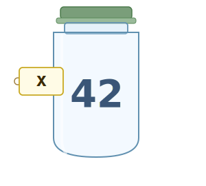
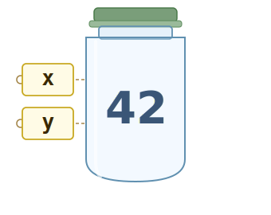
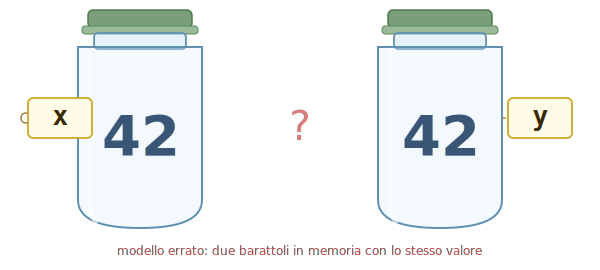
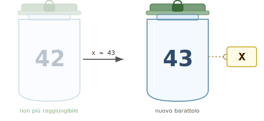
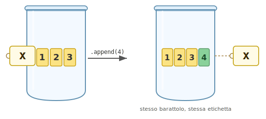

# Modulo 06 · Memoria e passaggio degli argomenti

## A fine lezione

- Sai spiegare la differenza tra una variabile che punta a un intero e una che punta a una lista?
- Sai prevedere cosa succede alla lista originale quando la passi a una funzione e la modifichi dentro?
- Sai distinguere una funzione pura da una funzione void?
- Sai riconoscere quando una funzione ha un effetto collaterale?
- Sai scrivere una versione in-place e una versione con copia di una stessa operazione su lista?

## Variabili come nomi

Per immaginare lo stato dell'esecuzione, finora abbiamo usato la metafora dei barattoli: una variabile è come un barattolo con un nome scritto sopra, e dentro il barattolo si mette un valore.

Questo modello funziona per i programmi semplici, ma crea problemi non appena usiamo le liste.

Consideriamo questo programma:
```python
x = 42
y = x
```

- `x = 42` crea un barattolo contenente `42` e attacca l'etichetta `x`:



- `y = x` attacca una seconda etichetta `y` **allo stesso barattolo** — non crea un barattolo nuovo:



Dopo queste due istruzioni, `x` e `y` sono due etichette sullo **stesso barattolo**:

```
  x ──┐
      ├──► [ 42 ]
  y ──┘
```

Si potrebbe pensare che Python crei due barattoli separati, ognuno con il proprio `42`:



Ma non è così. Non ci sono due `42` in memoria — ce n'è uno solo, con due etichette attaccate allo stesso barattolo:


Possiamo verificarlo con `id()`, che restituisce un numero che identifica univocamente un oggetto durante l'esecuzione:

```python
print(id(x))   # es. 4305765744
print(id(y))   # stesso numero: stesso oggetto
```

### Cosa succede con `y = y + 1`

```python
y = y + 1
```

Il barattolo `42` è sigillato: non si può modificare. Python crea un **nuovo barattolo** con `43` e sposta l'etichetta `y` su di esso; l'etichetta `x` rimane sul barattolo `42`.

```
  x ──► [ 42 ]
  y ──► [ 43 ]   ← nuovo barattolo; [ 42 ] non è cambiato
```

```python
print(x)       # 42  ← x non è cambiata
print(y)       # 43
print(id(x))   # stesso di prima
print(id(y))   # numero diverso: barattolo diverso
```

Questo comportamento vale per tutti i tipi **immutabili**: interi, float, stringhe, booleani.
Una volta creati, non cambiano. L'assegnazione sposta il riferimento, non modifica l'oggetto.

## Le liste sono diverse: barattoli aperti

C'è una distinzione fondamentale tra due tipi di variabili:

- Tipi **immutabili**: barattoli sigillati (interi, stringhe, …) di cui non si può cambiare il contenuto; se serve un valore diverso, si crea un barattolo nuovo e si sposta l'etichetta



- Tipi **mutabili**: barattoli aperti (liste, …), a cui si può aggiungere o togliere contenuto senza creare un nuovo barattolo; chi ha un'etichetta su quel barattolo vede subito le modifiche.



Le liste sono **mutabili**: si possono modificare senza creare un nuovo oggetto.

```python
lista = [1, 2, 3]
print(id(lista))   # es. 4372891456

lista.append(4)
print(id(lista))   # stesso numero: è ancora lo stesso oggetto, modificato
```

### Operazioni in-place sulle liste

Queste operazioni modificano la lista esistente, senza crearne una nuova:

```python
numeri = [3, 1, 4, 1, 5]

numeri.append(9)        # aggiunge in fondo
numeri.sort()           # ordina sul posto
numeri.reverse()        # inverte sul posto
numeri.pop()            # rimuove l'ultimo elemento
del numeri[0]           # rimuove l'elemento all'indice 0
```

Tutte restituiscono `None` — non producono una nuova lista, modificano quella esistente.

## Alias: quando due nomi puntano allo stesso oggetto

```python
a = [1, 2, 3]
b = a
```

`b = a` **non copia la lista**. Copia solo il riferimento: ora `a` e `b` puntano allo **stesso oggetto**.

```
  a ──┐
      ├──► [ 1, 2, 3 ]
  b ──┘
```

Quindi qualsiasi modifica fatta tramite `b` sarà visibile anche da `a`:

```python
b.append(4)
print(a)   # [1, 2, 3, 4]  ← anche a è cambiata!
```

Questo si chiama **aliasing**: due nomi diversi per lo stesso oggetto.

### Come fare una copia vera

Per ottenere una lista indipendente dobbiamo costruirne una nuova elemento per elemento:

```python
def copia_lista(originale):
    nuova = []
    i = 0
    while i < len(originale):
        nuova.append(originale[i])
        i = i + 1
    return nuova
```

```python
a = [1, 2, 3]
b = copia_lista(a)
```

Ora `a` e `b` puntano a **oggetti diversi** — due barattoli con lo stesso contenuto:

```
  a ──► [ 1, 2, 3 ]
  b ──► [ 1, 2, 3 ]   ← barattolo nuovo, costruito elemento per elemento
```

Modificare `b` non tocca `a`, perché sono oggetti indipendenti:

```python
b.append(4)
print(a)   # [1, 2, 3]   ← a non è cambiata
print(b)   # [1, 2, 3, 4]
```

### Identità vs uguaglianza: `is` vs `==`

- `a == b` confronta il **contenuto** — `True` se i valori sono uguali;
- `a is b` confronta l'**identità** — `True` solo se `a` e `b` puntano allo stesso oggetto.

```python
a = [1, 2, 3]
b = copia_lista(a)   # oggetto diverso, stesso contenuto
c = a                # alias: stesso oggetto

print(a == b)   # True  ← contenuto uguale
print(a is b)   # False ← oggetti diversi

print(a == c)   # True  ← contenuto uguale
print(a is c)   # True  ← stesso oggetto
```

### Tabella di tracciamento: alias vs copia

```python
a = [10, 20, 30]
b = a                  # alias
c = copia_lista(a)     # copia

b[0] = 99
c[2] = 77
```

| Passo | Codice sorgente      | Stato del programma                                           | Output         |
| ----- | -------------------- | ------------------------------------------------------------- | -------------- |
| 1     | `a = [10, 20, 30]`   | `a` → `[10, 20, 30]`                                          | —              |
| 2     | `b = a`              | `a,b` → `[10, 20, 30]` (stesso oggetto)                       | —              |
| 3     | `c = copia_lista(a)` | `a,b` → `[10, 20, 30]` · `c` → `[10, 20, 30]` (oggetto nuovo) | —              |
| 4     | `b[0] = 99`          | `a,b` → `[99, 20, 30]` · `c` → `[10, 20, 30]`                 | —              |
| 5     | `c[2] = 77`          | `a,b` → `[99, 20, 30]` · `c` → `[10, 20, 77]`                 | —              |
| 6     | `print(a)`           | `a,b` → `[99, 20, 30]` · `c` → `[10, 20, 77]`                 | `[99, 20, 30]` |
| 7     | `print(c)`           | `a,b` → `[99, 20, 30]` · `c` → `[10, 20, 77]`                 | `[10, 20, 77]` |

Al passo 4 la modifica tramite `b` cambia anche `a`, perché puntano allo stesso barattolo.
Al passo 5 la modifica su `c` non tocca `a` né `b`, perché `c` è un barattolo indipendente.

## Esercizi: riferimenti e memoria

### Cosa stampa questo programma?

Per ciascun frammento, compila la tabella riga per riga e scrivi l'output finale prima di eseguire il codice.

**A1.**

```python
x = 5
y = x
y = y + 3
print(x)
print(y)
```

| Passo | Codice sorgente | Stato del programma | Output |
| ----- | --------------- | ------------------- | ------ |
| 1 | `x = 5` | | |
| 2 | `y = x` | | |
| 3 | `y = y + 3` | | |
| 4 | `print(x)` | | |
| 5 | `print(y)` | | |

**A2.**

```python
a = [1, 2, 3]
b = a
b.append(4)
print(a)
print(b)
```

| Passo | Codice sorgente | Stato del programma | Output |
| ----- | --------------- | ------------------- | ------ |
| 1 | `a = [1, 2, 3]` | | |
| 2 | `b = a` | | |
| 3 | `b.append(4)` | | |
| 4 | `print(a)` | | |
| 5 | `print(b)` | | |

**A3.**

```python
a = [1, 2, 3]
b = copia_lista(a)
b.append(4)
print(a)
print(b)
```

| Passo | Codice sorgente | Stato del programma | Output |
| ----- | --------------- | ------------------- | ------ |
| 1 | `a = [1, 2, 3]` | | |
| 2 | `b = copia_lista(a)` | | |
| 3 | `b.append(4)` | | |
| 4 | `print(a)` | | |
| 5 | `print(b)` | | |

**A4.**

```python
a = [10, 20, 30]
b = a
a = [10, 20, 30]
b.append(99)
print(a)
print(b)
```

Attenzione: al passo 3 `a` viene **riassegnata** — non modificata.

| Passo | Codice sorgente | Stato del programma | Output |
| ----- | --------------- | ------------------- | ------ |
| 1 | `a = [10, 20, 30]` | | |
| 2 | `b = a` | | |
| 3 | `a = [10, 20, 30]` | | |
| 4 | `b.append(99)` | | |
| 5 | `print(a)` | | |
| 6 | `print(b)` | | |

### Vero o falso?

Per ciascuna affermazione scrivi V o F e motiva la risposta.

1. Dopo `x = 3` e `y = x`, eseguire `y = y + 1` cambia anche `x`.
2. Dopo `a = [1, 2]` e `b = a`, eseguire `b.append(3)` cambia anche `a`.
3. Dopo `a = [1, 2]` e `b = copia_lista(a)`, le due liste puntano allo stesso oggetto.
4. Se `a == b` allora `a is b`.
5. Se `a is b` allora `a == b`.
6. `a = [1, 2, 3]` e `b = [1, 2, 3]` scritti su righe separate creano due riferimenti distinti.

### Scrivere codice con il comportamento richiesto

Per ciascun esercizio scrivi un programma che produca esattamente l'output indicato. Verifica con `print` e, dove richiesto, con `is`.

**B1.** Inizializza una lista contenente i numeri `1, 2, 3`. Crea una seconda variabile che punta alla **stessa lista** e usala per aggiungere `99`. Stampa entrambe le variabili e verifica con `is` che siano lo stesso oggetto.

Output atteso:
```
[1, 2, 3, 99]
[1, 2, 3, 99]
True
```

**B2.** Inizializza una lista contenente i numeri `1, 2, 3`. Creane una **copia indipendente** e aggiungi `99` alla copia. Stampa entrambe e verifica con `is` che siano oggetti distinti.

Output atteso:
```
[1, 2, 3]
[1, 2, 3, 99]
False
```

**B3.** Leggi numeri interi dall'input fino a quando l'utente inserisce `0`. Salva in una lista solo i numeri **pari**. Poi crea una copia della lista e, nella copia, sostituisci ogni numero con il suo doppio. Stampa la lista originale e la copia.

Esempio:
```
Input: 4 7 2 9 6 0
Lista pari:  [4, 2, 6]
Lista doppi: [8, 4, 12]
```

**B4.** Leggi numeri interi dall'input fino a `0`. Salva tutti i numeri in una lista. Crea una seconda lista che contiene solo i numeri **maggiori della media**. Stampa la lista originale e la lista filtrata. La lista originale non deve essere modificata.

Esempio:
```
Input: 3 8 2 10 5 0
Lista originale: [3, 8, 2, 10, 5]
Sopra la media: [8, 10]
```

**B4.** Leggi numeri interi positivi dall'input fino a `0` (ignora i numeri negativi). Salva tutti i numeri in una lista. Crea una seconda lista che contiene solo i numeri **maggiori della media** e sostituisci questi numeri con `-1` nella lista originale. Stampa la lista originale e la lista filtrata.

Esempio:
```
Input: 3 8 2 10 5 0
Lista originale: [3, -1, 2, -1, 5]
Sopra la media: [8, 10]
```

## Passaggio degli argomenti alle funzioni

Quando si chiama una funzione, Python associa i parametri formali agli oggetti passati come argomenti — esattamente come farebbe con `=`.

### Tipi immutabili: il parametro è una copia locale

```python
def incrementa(n):
    n = n + 1
    print("dentro:", n)

x = 10
incrementa(x)
print("fuori:", x)
```

```
dentro: 11
fuori: 10
```

`n` dentro la funzione inizia puntando allo stesso oggetto di `x`. Ma quando scriviamo `n = n + 1`, creiamo un nuovo oggetto e spostiamo solo `n` — `x` rimane invariata.

```
  x ──┐
      ├──► [ 10 ]   ← all'inizio puntano allo stesso oggetto
  n ──┘

  dopo n = n + 1:
  x ──► [ 10 ]
  n ──► [ 11 ]   ← n ora punta a un nuovo oggetto
```

### Tipi mutabili: il parametro punta allo stesso oggetto

```python
def sostituisci_pari(lista):
    i = 0
    while i < len(lista):
        if lista[i]%2==0:
            lista[i] = 0
        i = i + 1
    return lista

numeri = [10, 11, 20, 21, 30, 31]
numeri_2 = sostituisci_pari(numeri)
print(numeri_2)       # [0, 11, 0, 21, 0, 31]
print(numeri)  # [0, 11, 0, 21, 0, 31]  ← la lista originale è cambiata!
```

Qui `lista` e `numeri` puntano **allo stesso oggetto**. Quando `lista[i] = 0` modifica la lista, la modifica è visibile anche da `numeri`.

```
  numeri ──┐
           ├──► [ 10, 11, 20, 21, 30, 31 ]
  lista  ──┘

  dopo le modifiche dentro la funzione:
  numeri ──┐
           ├──► [ 0, 11, 0, 21, 0, 31 ]
  lista  ──┘
```

## Effetti collaterali

L'esempio precedente mostra un comportamento sottile: `sostituisci_pari` riceve `numeri` come argomento, lo modifica attraverso il parametro `lista`, e la modifica è visibile anche fuori dalla funzione — senza che il codice chiamante lo abbia richiesto esplicitamente.

Una funzione ha un **effetto collaterale** quando modifica qualcosa al di fuori del proprio scope locale. Gli effetti collaterali più comuni sono:

- **modificare un oggetto mutabile** passato come parametro (liste, dizionari, …);
- **modificare una variabile globale**;
- **stampare a schermo** con `print`;
- **scrivere su un file**.

### Effetti collaterali visibili e nascosti

Gli effetti collaterali sono **utili** quando vogliamo modificare una struttura condivisa senza doverla copiare.

Sono **pericolosi** quando chi chiama la funzione non sa che la lista verrà modificata. L'errore tipico:

```python
def analisi(dati):
    dati.sort()                    # effetto collaterale nascosto
    media = sum(dati) / len(dati)
    return media

numeri = [5, 3, 1, 4, 2]
risultato = analisi(numeri)
print(numeri)   # [1, 2, 3, 4, 5]  ← la lista è stata ordinata di nascosto!
```

Il chiamante passa `numeri` aspettandosi solo la media — e si trova la lista riordinata senza averlo richiesto.

## Reminder: Funzioni pure

### Sintassi

```python
def nome_funzione(parametro_1, ..., parametro_n):
    # istruzioni
    return espressione
```

- `return espressione` è obbligatorio e produce il valore che la funzione restituisce.

### Semantica della chiamata

Quando Python incontra `nome_funzione(arg_1, ..., arg_n)`:

1. valuta gli argomenti da sinistra a destra;
2. assegna ogni valore al parametro corrispondente per posizione;
3. esegue il corpo della funzione;
4. quando incontra `return`, valuta l'espressione e **restituisce quel valore** al chiamante;
5. la chiamata si sostituisce con il valore restituito — è un'**espressione** con un tipo.

```python
media = somma_lista(dati) / len(dati)   # il valore entra in un calcolo
print(somma_lista(dati))                # il valore viene passato a print
if somma_lista(dati) > 100:             # il valore viene confrontato
    ...
```

### Principio di progetto

Una funzione pura non deve leggere né modificare variabili globali, né modificare gli oggetti ricevuti come parametri. Il risultato dipende esclusivamente dagli argomenti — chiamarla due volte con gli stessi argomenti produce sempre lo stesso risultato.

Python non lo impone: è una scelta del programmatore. Rispettarla rende le funzioni prevedibili, testabili e componibili.

## Funzioni void

Problema: Vogliamo una funzione che raddoppi tutti gli elementi di una lista.

**Tentativo con `return` (funzione pura):**

```python
def raddoppia(lista):
    nuova = []
    i = 0
    while i < len(lista):
        nuova.append(lista[i] * 2)
        i = i + 1
    return nuova
```

In questo modo dobbiamo per forza assegnare di nuovo la variabile `numeri` per usare il valore restituito:
```python
numeri = raddoppia(numeri)
print(numeri)            # [2, 4, 6]
```

Ma abbiamo visto che è possibile anche modificare direttamente la lista originale tramite una funzione e ottenere un comportamento del genere:

```python
numeri = [1, 2, 3]
raddoppia(numeri)        # effettua un'azione su numeri
print(numeri)            # [2, 4, 6]  ← lista modificata!
```

Per fare ciò abbiamo bisogno di un nuovo tipo di funzioni: le **funzioni void**

Grazie al fatto che `lista` e `numeri` possono puntare allo **stesso barattolo**, possiamo modificare ogni elemento direttamente dall'interno della funzione usando l'assegnazione per indice:

```python
def raddoppia_in_place(lista):
    i = 0
    while i < len(lista):
        lista[i] = lista[i] * 2
        i = i + 1
```

```python
numeri = [1, 2, 3]
raddoppia_in_place(numeri)
print(numeri)            # [2, 4, 6]  ← la lista originale è cambiata
```

Non c'è `return` — non serve. La funzione non calcola un valore: produce un **effetto** sul barattolo condiviso. Questa è la struttura di tutte le funzioni void.

> "void" non è una parola chiave Python (a differenza di C o Java) — è un termine convenzionale per descrivere questo comportamento.

### Sintassi delle funzioni void

```python
def nome_funzione(parametro_1, ..., parametro_n):
    # istruzioni
```

- non c'è `return`;
- Python restituisce implicitamente `None`.

### Semantica della chiamata void

Quando Python incontra `nome_funzione(arg_1, ..., arg_n)`:

1. valuta gli argomenti da sinistra a destra;
2. assegna ogni valore al parametro corrispondente per posizione;
3. esegue il corpo della funzione — gli effetti collaterali avvengono qui;
4. raggiunta la fine del corpo, la funzione termina restituendo `None`;
5. la chiamata è un'**istruzione** — non c'è un valore utile da riusare.

```python
raddoppia_elementi(dati)              # istruzione: corretto
risultato = raddoppia_elementi(dati)  # risultato è None: sbagliato
if raddoppia_elementi(dati):          # confronta None: sbagliato
    ...
```

> Le funzioni void sono il posto naturale per gli **effetti collaterali**. Il loro scopo è produrre un effetto nel mondo esterno — modificare una lista, stampare, scrivere su file — non calcolare un valore.


### Riepilogo: quale tipo di funzione usare

| Vuoi...                                            | Usa...        |
| -------------------------------------------------- | ------------- |
| Calcolare un valore da riusare altrove             | funzione pura |
| Stampare un risultato                              | funzione void |
| Modificare una lista in-place                      | funzione void |
| Produrre una nuova lista senza toccare l'originale | funzione pura |

## Una distinzione didattica, non una regola di Python

> La distinzione tra funzione pura e funzione void è uno strumento per **imparare a ragionare** sul codice — non una regola imposta da Python. In Python non esiste nessuna parola chiave, nessun controllo, nessuna differenza sintattica: tutto si scrive con `def`, e una funzione può restituire un valore, produrre effetti collaterali, o fare entrambe le cose insieme.

La libreria standard lo fa spesso:

```python
# list.pop(): rimuove l'ultimo elemento E lo restituisce
numeri = [10, 20, 30]
ultimo = numeri.pop()
print(ultimo)   # 30
print(numeri)   # [10, 20]  ← la lista è cambiata
```

```python
# sostituisci_pari: modifica la lista passata E la restituisce
def sostituisci_pari(lista):
    i = 0
    while i < len(lista):
        if lista[i] % 2 == 0:
            lista[i] = 0
        i = i + 1
    return lista

numeri = [10, 11, 20]
risultato = sostituisci_pari(numeri)
print(risultato)  # [0, 11, 0]
print(numeri)     # [0, 11, 0]  ← stessa lista: risultato e numeri puntano allo stesso oggetto
```

Questi esempi esistono, e li incontrerete. La distinzione pura/void serve a costruire un'abitudine: quando scrivete una funzione, decidete cosa fa — calcola un valore o produce un effetto — e non mescolate i due ruoli senza una ragione precisa.

## Esercizi

### Tracciamento della memoria

Per ciascun frammento, compila la tabella passo per passo: indica lo stato di tutte le variabili dopo ogni istruzione e, se qualcosa viene stampato, scrivilo nella colonna output.

**T1.** Alias e modifica in-place.

```python
a = [1, 2, 3]
b = a
b.append(4)
print(a)
print(b)
print(a is b)
```

| Passo | Codice sorgente | Stato | Output |
| ----- | --------------- | ----- | ------ |
| 1 | `a = [1, 2, 3]` | | |
| 2 | `b = a` | | |
| 3 | `b.append(4)` | | |
| 4 | `print(a)` | | |
| 5 | `print(b)` | | |
| 6 | `print(a is b)` | | |

**T2.** Copia esplicita e modifica.

```python
a = [1, 2, 3]
b = copia_lista(a)
b.append(4)
print(a)
print(b)
print(a is b)
```

(Usa la funzione `copia_lista` vista a lezione.)

| Passo | Codice sorgente | Stato | Output |
| ----- | --------------- | ----- | ------ |
| 1 | `a = [1, 2, 3]` | | |
| 2 | `b = copia_lista(a)` | | |
| 3 | `b.append(4)` | | |
| 4 | `print(a)` | | |
| 5 | `print(b)` | | |
| 6 | `print(a is b)` | | |

**T3.** Passaggio di lista a funzione void.

```python
def f(lista):
    lista.append(99)

x = [10, 20]
f(x)
print(x)
```

| Passo | Codice sorgente | Stato | Output |
| ----- | --------------- | ----- | ------ |
| 1 | `x = [10, 20]` | | |
| 2 | chiama `f(x)` | | |
| 3 | `lista.append(99)` | | |
| 4 | fine `f` | | |
| 5 | `print(x)` | | |

**T4.** Tipo immutabile come parametro.

```python
def h(n):
    n = n + 1
    return n

x = 5
y = h(x)
print(x)
print(y)
```

| Passo | Codice sorgente | Stato | Output |
| ----- | --------------- | ----- | ------ |
| 1 | `x = 5` | | |
| 2 | chiama `h(x)` | | |
| 3 | `n = n + 1` | | |
| 4 | `return n` | | |
| 5 | `y = h(x)` | | |
| 6 | `print(x)` | | |
| 7 | `print(y)` | | |

### Scrivere funzioni pure

**E1.** Scrivi una funzione pura `massimo(lista)` che restituisce il valore massimo di una lista di interi.

**E2.** Scrivi una funzione pura `conta(lista, valore)` che restituisce quante volte `valore` compare in `lista`.

**E3.** Scrivi una funzione pura `inverti(lista)` che restituisce una **nuova lista** con gli elementi in ordine inverso, senza modificare quella originale.

**E4.** Scrivi una funzione pura `rimuovi_duplicati(lista)` che restituisce una **nuova lista** con gli stessi elementi ma senza ripetizioni (mantenendo l'ordine di prima apparizione).

```python
rimuovi_duplicati([1, 2, 1, 3, 2, 4])  # → [1, 2, 3, 4]
```

**E5.** Scrivi una funzione pura `unisci(a, b)` che restituisce una nuova lista con tutti gli elementi di `a` seguiti da tutti gli elementi di `b`, senza modificare né `a` né `b`.

**E6.** Scrivi una funzione pura `filtra_pari(lista)` che restituisce una nuova lista contenente solo i numeri pari.

### Scrivere funzioni void

**E7.** Scrivi una funzione void `inverti_in_place(lista)` che inverte la lista **modificandola direttamente**, senza creare una lista nuova.

**E8.** Scrivi una funzione void `azzera_negativi(lista)` che sostituisce ogni numero negativo con `0` **nella lista originale**.

```python
dati = [3, -1, 7, -4, 0]
azzera_negativi(dati)
print(dati)   # [3, 0, 7, 0, 0]
```

**E9.** Scrivi una funzione void `moltiplica_elementi(lista, fattore)` che moltiplica ogni elemento della lista per `fattore`, modificando la lista originale.

```python
dati = [1, 2, 3, 4]
moltiplica_elementi(dati, 3)
print(dati)   # [3, 6, 9, 12]
```

**E10.** Scrivi una funzione void `aggiungi_tutti(destinazione, sorgente)` che aggiunge tutti gli elementi di `sorgente` in fondo a `destinazione` in-place, senza creare nuove liste.

```python
a = [1, 2, 3]
b = [4, 5, 6]
aggiungi_tutti(a, b)
print(a)   # [1, 2, 3, 4, 5, 6]
print(b)   # [4, 5, 6]  ← invariata
```

## Import e file di libreria

Scrivere sempre le stesse funzioni di supporto in ogni programma è scomodo. Python permette di mettere funzioni in un file separato — chiamato **modulo** o **libreria** — e di riusarle altrove con `import`.

### Librerie locali

Un file Python può contenere funzioni da riusare in altri file della stessa cartella. Supponiamo di avere due file:

```python
# utils.py

def somma_lista(lista):
    totale = 0
    i = 0
    while i < len(lista):
        totale = totale + lista[i]
        i = i + 1
    return totale

def inverti(lista):
    risultato = []
    i = len(lista) - 1
    while i >= 0:
        risultato.append(lista[i])
        i = i - 1
    return risultato
```

```python
# main.py

import utils

dati = [3, 1, 4, 1, 5]
print(utils.somma_lista(dati))
print(utils.inverti(dati))
```

La sintassi `utils.somma_lista(dati)` si legge: "cerca la funzione `somma_lista` dentro il modulo `utils`". Il prefisso serve a evitare confusione quando due moduli diversi definiscono funzioni con lo stesso nome.

Regole da ricordare:

- il nome del modulo è il nome del file senza `.py`;
- `import utils` cerca `utils.py` nella stessa cartella del file che importa;
- le funzioni importate si comportano esattamente come quelle definite nello stesso file — incluso il passaggio degli argomenti.

### Librerie standard: `random`

Python viene distribuito con una collezione di librerie già pronte, chiamata **libreria standard**. Non contengono codice da scrivere: basta importarle.

Una delle più usate è `random`, che genera valori casuali:

```python
import random

print(random.randint(1, 6))    # intero casuale tra 1 e 6 (inclusi)
print(random.random())         # float casuale tra 0.0 e 1.0
```

Ogni chiamata a `randint` produce un risultato diverso — non è deterministica come le funzioni che abbiamo scritto finora.

Esempio: simulare dieci lanci di dado e raccogliere i risultati in una lista.

```python
import random

def lanci_dado(n):
    risultati = []
    i = 0
    while i < n:
        risultati.append(random.randint(1, 6))
        i = i + 1
    return risultati

print(lanci_dado(10))   # es. [3, 1, 6, 2, 6, 4, 1, 5, 3, 2]
```

`random` offre anche `random.shuffle(lista)`, che mescola una lista **in-place** (funzione void):

```python
import random

carte = [1, 2, 3, 4, 5, 6, 7, 8, 9, 10]
random.shuffle(carte)
print(carte)   # ordine casuale
```

## Esercizi con `random`

**L1.** Scrivi una funzione `conta_sei(n)` che simula `n` lanci di un dado a sei facce e restituisce quante volte è uscito `6`.

```python
print(conta_sei(1000))   # es. 162  (circa 1/6 di 1000)
```

**L2.** Scrivi una funzione `lista_casuale(n, minimo, massimo)` che restituisce una lista di `n` interi casuali compresi tra `minimo` e `massimo`.

```python
print(lista_casuale(5, 1, 100))   # es. [47, 3, 82, 19, 61]
```

**L3.** Usando `random.shuffle`, scrivi una funzione void `mischia(lista)` che mescola la lista originale. Poi scrivi una funzione pura `mescolata(lista)` che restituisce una **nuova lista** mescolata senza modificare l'originale.

```python
dati = [1, 2, 3, 4, 5]

mischia(dati)
print(dati)          # ordine casuale, originale modificata

nuova = mescolata(dati)
print(dati)          # invariata
print(nuova)         # ordine diverso
```